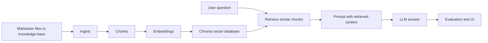

# Module 04 - Retrieval-Augmented Generation (RAG)

This module teaches Retrieval-Augmented Generation from first principles using a small but complete company assistant. The goal is not only to run a demo. The goal is to understand the whole machine: why RAG exists, how documents become searchable, how a question finds useful evidence, how that evidence enters the prompt, and how we measure whether the system worked.

You work with a fictional company, **Insurellm**, and a Markdown knowledge base containing company pages, product summaries, contracts, and employee records. The runnable system lives under [`rag-system/`](rag-system/).

## What RAG Means

A plain LLM answers from the information already inside the model plus whatever you put in the prompt. A RAG system adds a retrieval step before generation:

1. Store your documents in a searchable form.
2. Retrieve the few pieces most relevant to a user question.
3. Put those pieces into the prompt as context.
4. Ask the LLM to answer using that context.

That turns the model from a closed-book answer generator into an open-book assistant.

## What You Will Learn

- Why organizations add retrieval to LLM systems for accuracy, freshness, and control.
- What embeddings are, why vector databases exist, and how semantic similarity works.
- Why documents are split into chunks before they are embedded.
- How the baseline RAG system ingests Markdown into Chroma and answers questions with OpenAI.
- How the advanced system uses LLM chunking, query rewriting, dual retrieval, and reranking.
- How retrieval metrics and LLM-as-a-judge evaluate different parts of the pipeline.
- What changes when a learning prototype moves toward production.

## The Big Picture



The important idea is that the LLM does not search your files by itself. The Python code searches first, then gives the model the retrieved text.

## Repository Layout

| Path | Role |
|------|------|
| [`documentation/`](documentation/) | Course-style guides. Start with [`documentation/README.md`](documentation/README.md). |
| [`rag-system/README.md`](rag-system/README.md) | Practical map of the runnable code. |
| [`rag-system/knowledge-base/`](rag-system/knowledge-base/) | Source Markdown corpus. These files are the facts the assistant retrieves from. |
| [`rag-system/implementation/`](rag-system/implementation/) | Baseline ingest and answer pipeline. Used by the chat app and default evaluation harness. |
| [`rag-system/pro_implementation/`](rag-system/pro_implementation/) | Advanced ingest and answer pipeline. Separate from the baseline path. |
| [`rag-system/evaluation/`](rag-system/evaluation/) | Test questions, retrieval metrics, and LLM judge code. |
| [`rag-system/examples/`](rag-system/examples/) | Small progressive scripts aligned with the documentation. |
| [`rag-system/app.py`](rag-system/app.py) | Gradio chat UI for the baseline assistant. |
| [`rag-system/evaluator.py`](rag-system/evaluator.py) | Gradio dashboard for batch evaluation. |

## Baseline Vs Advanced

| System | Ingest command | Answer code | Database | Main purpose |
|--------|----------------|-------------|----------|--------------|
| Baseline | `python -m implementation.ingest` | `implementation/answer.py` | `vector_db/` | Teach the standard RAG loop clearly. |
| Advanced | `python -m pro_implementation.ingest` | `pro_implementation/answer.py` | `preprocessed_db/` | Show production-shaped retrieval improvements. |

The baseline is the main learning path. The advanced stack is a second architecture to compare against it.

## Prerequisites

- Python 3.10+ recommended.
- An OpenAI API key for the baseline embeddings and chat calls.
- Optional but helpful: earlier modules on LLM basics, model selection, and evaluation.

## Setup

```bash
cd "LLM Fundamentals & Engineering/04-retrieval-augmented-generation"
python -m venv .venv
source .venv/bin/activate   # Windows: .venv\Scripts\activate
pip install -r requirements.txt
```

Create `rag-system/.env`:

```text
OPENAI_API_KEY=sk-...
```

## Typical Baseline Workflow

All commands below assume your shell is inside `rag-system/`.

```bash
cd rag-system
python -m implementation.ingest
python app.py
```

`implementation.ingest` builds the searchable Chroma database. `app.py` starts the chat interface and calls the same answering code that the evaluator uses.

Example ingest output:

```text
Loaded 76 source documents
Created 432 chunks (size=500, overlap=200)
There are 432 vectors with 3,072 dimensions in the vector store
Ingestion complete
```

## Evaluation CLI

```bash
cd rag-system
python evaluation/eval.py 0
```

This runs one test row through two checks:

- Retrieval evaluation: did the retrieved chunks contain expected evidence keywords?
- Answer evaluation: did the generated answer match the reference answer according to an LLM judge?

## Progressive Examples

| Script | Idea |
|--------|------|
| [`examples/01_keyword_retrieval_demo.py`](rag-system/examples/01_keyword_retrieval_demo.py) | Starts with simple keyword overlap before embeddings. |
| [`examples/02_embeddings_and_visualization.py`](rag-system/examples/02_embeddings_and_visualization.py) | Shows chunking, local embeddings, and optional t-SNE visualization. |
| [`examples/03_basic_rag_demo.py`](rag-system/examples/03_basic_rag_demo.py) | Sends one question through the baseline `answer_question` function. |
| [`examples/04_evaluation_demo.py`](rag-system/examples/04_evaluation_demo.py) | Prints retrieval metrics for one test row. |
| [`examples/05_advanced_rag_demo.py`](rag-system/examples/05_advanced_rag_demo.py) | Demonstrates query rewriting, dual retrieval, and reranking. |

## Recommended Reading Path

Open [`documentation/README.md`](documentation/README.md) first. It now includes a course map, a file map, and a guided path from basic ideas to implementation details.

## What To Remember

- RAG is a pipeline, not a single model call.
- Ingest happens before users ask questions; retrieval and generation happen at question time.
- The baseline stack is what `app.py`, `evaluator.py`, and `evaluation/eval.py` use by default.
- The advanced stack is separate, so changing it will not change baseline evaluation results unless you rewire the imports.

Next: [`documentation/README.md`](documentation/README.md)
