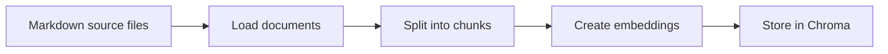
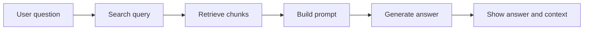
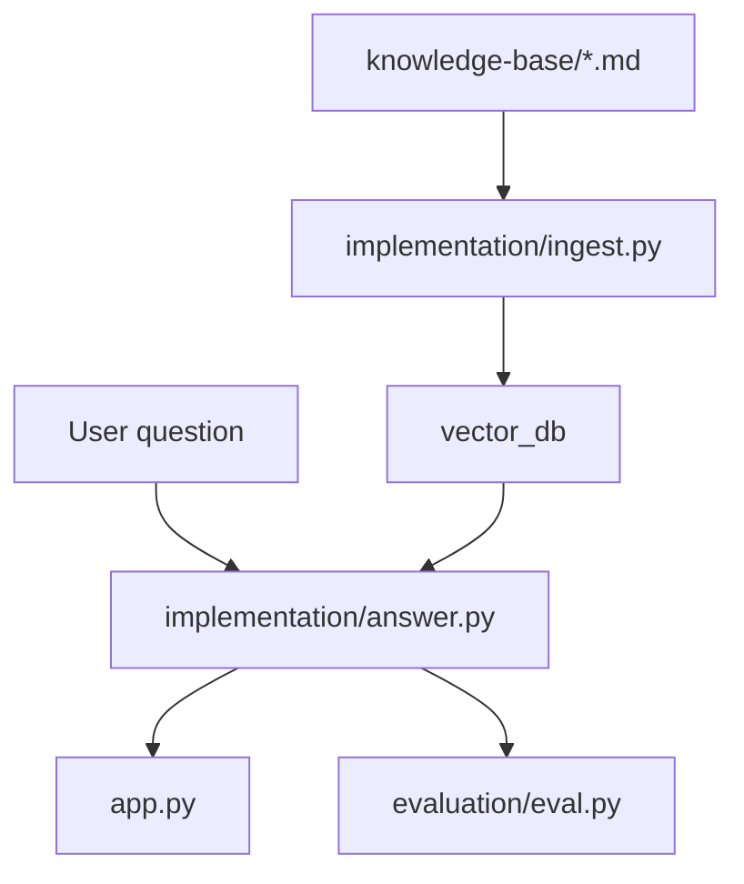
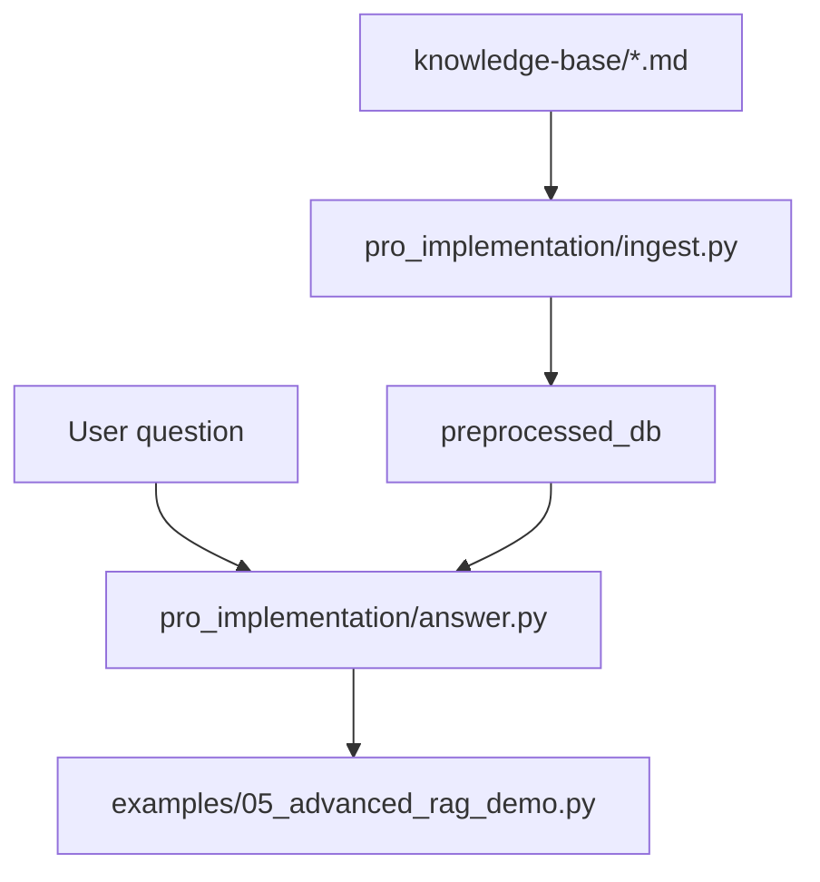
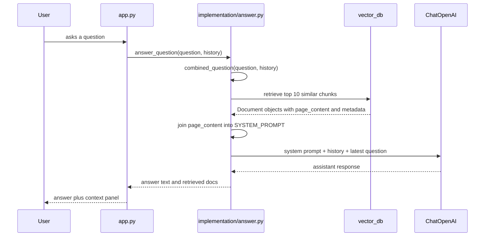

# 00 - System Map And File Tour

## Why Start Here

Beginners often struggle with RAG because the same words appear at different layers. "Embedding" can mean the model, the vector it returns, or the stored database field. "Retrieval" can mean the whole search pipeline or one function call. This guide gives you the map before the details.

By the end, you should be able to point to a file and say:

- what part of the RAG system it belongs to,
- what data it receives,
- what data it produces,
- why that part exists.

## The Two Timelines

RAG has an offline timeline and an online timeline.

The offline timeline happens before a user asks a question:

The online timeline happens every time a user asks a question:

The connection is the vector database. Ingest writes it. Answering reads it.

## Baseline System: The Main Learning Path

The baseline system is intentionally simple:

### Files In The Baseline Path

| File | Role | Input | Output |
|------|------|-------|--------|
| `knowledge-base/**/*.md` | Source facts. | Written Markdown files. | Raw document text. |
| `implementation/ingest.py` | Builds the searchable database. | Markdown files. | `vector_db/`. |
| `implementation/answer.py` | Retrieves context and asks the LLM to answer. | Question, optional chat history, `vector_db/`. | Answer text and retrieved `Document` objects. |
| `app.py` | Human-facing chat app. | User messages. | Chat response plus visible retrieved context. |
| `evaluation/eval.py` | Automated scoring. | Test questions and baseline answers. | Retrieval metrics and judge scores. |
| `evaluator.py` | Visual evaluation dashboard. | Batch evaluation functions. | Metric cards and charts. |

## Advanced System: The Comparison Path

The advanced system is separate from the baseline system:

The advanced path adds three ideas:

- LLM chunking during ingest.
- Query rewriting before retrieval.
- LLM reranking after retrieval.

The default chat app and evaluation code do not use this path unless you change the imports.

## Folder Tour

### `knowledge-base/`

This is the source corpus. It contains four categories:

| Folder | What it contains | Why it matters for RAG |
|--------|------------------|------------------------|
| `company/` | Overview, culture, careers, about pages. | Broad facts such as founding year, locations, and headcount. |
| `products/` | Product descriptions and pricing. | Product-specific questions. |
| `contracts/` | Customer contract details. | Questions about terms, dates, pricing, and customer relationships. |
| `employees/` | HR-style employee records. | People, roles, salaries, awards, and responsibilities. |

These files are not "documentation" for humans to study line by line. They are the data the RAG system retrieves from.

### `implementation/`

This is the baseline RAG implementation.

- `ingest.py` prepares the database.
- `answer.py` answers questions from that database.

The baseline uses LangChain because it hides some plumbing and keeps the first implementation readable.

### `pro_implementation/`

This is the advanced implementation.

- `ingest.py` asks an LLM to create richer chunks.
- `answer.py` rewrites the question, retrieves from two query forms, deduplicates, reranks, and answers.

The advanced version uses lower-level Chroma calls so the retrieval steps are explicit.

### `evaluation/`

This folder turns "the assistant seems good" into measurable checks.

- `tests.jsonl` stores 150 test questions.
- `test.py` loads those rows into `TestQuestion` objects.
- `eval.py` runs retrieval and answer evaluation against the baseline path.

### `examples/`

The examples are small scripts that match the learning order:

1. keyword overlap,
2. embeddings,
3. baseline RAG,
4. retrieval evaluation,
5. advanced RAG.

Use them when a full app feels like too much surface area.

## Data Lifecycle In One Question

Question: "How many employees does Insurellm currently have?"

The source facts came from `knowledge-base/company/overview.md`, but the model does not open that file at answer time. It receives retrieved chunk text from Chroma.

## The Core Data Shapes

| Shape | Where you see it | What it contains |
|-------|------------------|------------------|
| Source document | `DirectoryLoader` in `implementation/ingest.py` | Full Markdown file text plus metadata such as source path. |
| Chunk | `create_chunks()` | Smaller text slice, still with metadata. |
| Embedding | `OpenAIEmbeddings` or `openai_client.embeddings.create` | Numeric vector representing text meaning. |
| Stored vector row | Chroma | Chunk text, vector, ID, metadata. |
| Retrieved document | `fetch_context()` | The chunks selected for one user question. |
| Prompt messages | `answer_question()` | System prompt with context, prior chat messages, latest user question. |
| Evaluation row | `TestQuestion` | Question, expected keywords, reference answer, category. |

## Why The Design Is Split This Way

The split teaches a practical engineering boundary:

- Ingest is expensive but occasional. You run it when the knowledge base changes.
- Answering is latency-sensitive. It runs every time a user asks something.
- Evaluation is separate so you can compare changes without clicking through the UI.
- Examples are separate so beginners can isolate one idea at a time.

## Common Beginner Confusions

| Confusion | Clear version |
|-----------|---------------|
| "Does the LLM search the files?" | No. Python retrieves chunks first, then the LLM reads those chunks in the prompt. |
| "Are embeddings the answer?" | No. Embeddings are only for search. The chat model generates the final text. |
| "Is Chroma generating text?" | No. Chroma stores vectors and returns similar chunks. |
| "Does evaluation use the advanced system?" | No. `evaluation/eval.py` imports `implementation.answer` by default. |
| "Why keep source metadata?" | So you can inspect where a retrieved chunk came from and debug bad answers. |

## What To Read Next

Now that you know the file map, continue with the reason RAG exists before studying embeddings.

Next: [`01-what-is-rag-and-why-it-exists.md`](01-what-is-rag-and-why-it-exists.md)
