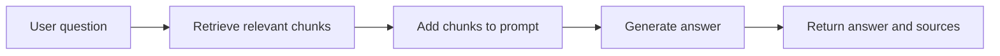

# 01 - What Is RAG And Why It Exists

## The Beginner Version

Retrieval-Augmented Generation means:

> Find relevant information first, then ask the LLM to answer with that information in front of it.

The LLM is still the writer and reasoner. Retrieval is the part that brings the right evidence to the desk before the model starts writing.

## The Problem RAG Solves

A plain LLM has three weaknesses for company Q&A:

1. It may not know private company documents.
2. It may not know recently changed facts.
3. It may sound confident even when it is guessing.

For example, the model cannot reliably answer "How many employees does Insurellm currently have?" unless the prompt includes the right internal source text. That fact lives in the module's Markdown knowledge base, not inside the model by default.

## Closed-Book Vs Open-Book

Imagine two exams:

- Closed-book exam: the student answers from memory.
- Open-book exam: the student first opens the textbook to relevant pages.

Plain prompting is often closed-book. RAG is open-book. The retrieval system chooses the "pages" and the model writes the answer after reading them.

## Why Not Paste Every Document Into The Prompt?

There are two practical limits.

First, LLMs have a context window: a maximum amount of text they can read in one request. A real company knowledge base can be larger than that window.

Second, even if the model could read everything, sending every document would be slow, expensive, and noisy. A question about employee awards does not need every product contract.

RAG solves this by selecting a small set of likely relevant chunks for each question.

## The RAG Loop



In this repository, that loop is implemented by [`rag-system/implementation/answer.py`](../rag-system/implementation/answer.py). The searchable chunk database is built earlier by [`rag-system/implementation/ingest.py`](../rag-system/implementation/ingest.py).

## Where The Facts Come From

The facts are stored in [`rag-system/knowledge-base/`](../rag-system/knowledge-base/):

| Folder | Example questions it can answer |
|--------|---------------------------------|
| `company/` | When was Insurellm founded? How many employees does it have? |
| `products/` | What does Carllm do? What is a pricing tier? |
| `contracts/` | Which customer bought which product? What are contract terms? |
| `employees/` | Who has a given role? What award did someone win? |

The LLM does not automatically know these files. The RAG pipeline must retrieve from them.

## A Simple First Retrieval System

Before embeddings, the module includes a deliberately simple keyword demo: [`examples/01_keyword_retrieval_demo.py`](../rag-system/examples/01_keyword_retrieval_demo.py).

That script does four things:

1. Loads employee and product Markdown files.
2. Tokenizes the question into lowercase words.
3. Counts word overlap between the question and each document.
4. Sends the best matching text to the chat model as context.

Run it from `rag-system/`:

```bash
python examples/01_keyword_retrieval_demo.py
```

Example output:

```text
Question: Who won the IIOTY award in 2023?

--- Retrieved context (keyword overlap) ---

[Matched bucket: thompson | overlap score: 12]

# Maxine Thompson
...

Model answer:
 Maxine Thompson won the Insurellm Innovator of the Year (IIOTY) award in 2023.
```

## What This Demo Teaches

Keyword retrieval already shows the RAG pattern:

- It retrieves some text.
- It puts that text into the model request.
- The model answers using the retrieved text.

But keyword retrieval is brittle. It can fail when the user and document use different words for the same idea.

Example:

| User says | Document says | Why keyword search struggles |
|-----------|---------------|------------------------------|
| "auto insurance" | "Carllm" | The exact words do not overlap much. |
| "who runs marketing?" | "Head of Brand Strategy" | The meaning is similar but the words differ. |
| "current headcount" | "32 employees" | The answer is numeric and phrase-dependent. |

This motivates embeddings and semantic search, which are introduced in guide 02.

## How This Connects To The Baseline Code

The simple keyword demo is not the final system. It is a stepping stone.

| Teaching idea | Simple demo | Baseline implementation |
|---------------|-------------|-------------------------|
| Load source text | `glob` and `open()` | `DirectoryLoader` in `implementation/ingest.py` |
| Choose relevant text | word overlap count | vector similarity in Chroma |
| Add context to prompt | f-string with `Context:` | `SYSTEM_PROMPT.format(context=...)` |
| Generate answer | OpenAI chat call | `ChatOpenAI.invoke()` |

The baseline system replaces keyword overlap with embedding search, but the core idea stays the same.

## What To Remember

- RAG gives the model evidence before it answers.
- Retrieval is separate from generation.
- The source documents live in `knowledge-base/`; the model only sees the chunks that retrieval returns.
- The keyword demo is intentionally limited so you can understand the pattern before vector search.

Next: [`02-embeddings-and-vector-databases.md`](02-embeddings-and-vector-databases.md)
