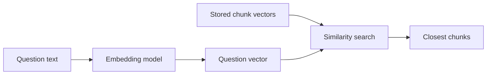
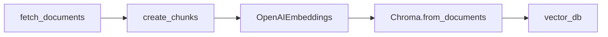

# 02 - Embeddings And Vector Databases

## Why This Topic Exists

Keyword search only works when the user's words overlap with the document's words. Real users paraphrase. They say "auto policy" when the document says "Carllm", or "who handles brand?" when the profile says "Head of Brand Strategy".

Embeddings help the system search by meaning instead of exact words.

## What Is An Embedding?

An embedding is a list of numbers that represents the meaning of a piece of text.

For example:

```text
"car insurance pricing"  ->  [0.02, -0.11, 0.43, ...]
"automobile policy cost" ->  [0.03, -0.10, 0.41, ...]
"cake recipe"           ->  [-0.55, 0.08, 0.12, ...]
```

The exact numbers are not meant to be read by humans. Their purpose is distance. Texts with similar meanings should have vectors that are close to each other.

Analogy: a map. You do not need to memorize every coordinate. You only need to know that nearby coordinates represent nearby places.

## Embeddings In This Module

The baseline code uses OpenAI's `text-embedding-3-large` model:

- Ingest: [`implementation/ingest.py`](../rag-system/implementation/ingest.py) embeds each chunk before storing it.
- Answering: [`implementation/answer.py`](../rag-system/implementation/answer.py) embeds the user query during retrieval.

The model returns 3072 numbers for each text input. That is why ingest prints output like:

```text
There are 432 vectors with 3,072 dimensions in the vector store
```

That means the database contains 432 chunk vectors, and each vector has 3072 numeric dimensions.

## Inspect One Embedding

After setting `OPENAI_API_KEY`, you can run a small check:

```python
from dotenv import load_dotenv
from openai import OpenAI

load_dotenv()
client = OpenAI()

response = client.embeddings.create(
    model="text-embedding-3-large",
    input="Insurellm sells insurance software.",
)

vector = response.data[0].embedding
print("dimensions:", len(vector))
print("first 8 values:", [round(x, 5) for x in vector[:8]])
```

Example output:

```text
dimensions: 3072
first 8 values: [-0.02137, 0.01452, -0.00391, 0.00814, -0.01022, 0.00456, -0.00188, 0.0129]
```

Do not attach meaning to a single dimension. The useful meaning comes from the whole vector and how it compares to other vectors.

## Semantic Similarity

Semantic similarity means similarity of meaning.

In vector search, a query is embedded into the same kind of vector as the stored chunks. The system then asks: which stored vectors are closest to this query vector?



The distance calculation is usually cosine similarity or a related vector distance. You do not need deep linear algebra to use it. The main idea is:

- close vectors usually mean related text,
- far vectors usually mean unrelated text.

## What A Vector Database Stores

A vector database stores rows shaped like this:

| Field | Meaning |
|-------|---------|
| `id` | A unique row identifier. |
| `embedding` | The numeric vector. |
| `document` or `page_content` | The chunk text to show the LLM later. |
| `metadata` | Extra information such as source file and document type. |

The metadata matters because it lets you debug answers. If a retrieved chunk is wrong, you can see which file it came from.

## Why Chroma Is Used Here

This module uses Chroma because it is simple to run locally and persists to a folder:

- baseline database: `rag-system/vector_db/`,
- advanced database: `rag-system/preprocessed_db/`.

Chroma is not the only option. Production systems may use pgvector, Pinecone, Weaviate, Elasticsearch/OpenSearch hybrid retrieval, or a managed cloud search system. For learning, Chroma keeps the storage layer easy to inspect and reset.

## How Baseline Ingest Creates Vectors

Run from `rag-system/`:

```bash
python -m implementation.ingest
```

The code path is:



`OpenAIEmbeddings(model=EMBEDDING_MODEL)` creates the embedding client. `Chroma.from_documents(...)` embeds the chunks and persists them.

Example output:

```text
Loaded 76 source documents
Created 432 chunks (size=500, overlap=200)
There are 432 vectors with 3,072 dimensions in the vector store
Ingestion complete
```

## Local Embeddings Demo

[`examples/02_embeddings_and_visualization.py`](../rag-system/examples/02_embeddings_and_visualization.py) uses `sentence-transformers/all-MiniLM-L6-v2`, a smaller local embedding model. It is useful for learning because you can see embeddings without calling the OpenAI embeddings API.

Run:

```bash
python examples/02_embeddings_and_visualization.py
```

Example output:

```text
Loading Markdown from: .../rag-system/knowledge-base
Loaded 76 raw documents
Split into 210 chunks (size=1000, overlap=200)
Embedding model: sentence-transformers/all-MiniLM-L6-v2
Each chunk vector has dimension 384
First 8 values of one vector: [0.0312, -0.1204, 0.0088, ...]
Saved t-SNE plot to: .../rag-system/examples/_tsne_demo.png
```

The local model returns 384-dimensional vectors, not 3072-dimensional vectors. Different embedding models have different vector sizes, costs, speed, and quality.

## Important Distinction

Embeddings do not generate answers. They only help find relevant text.

| Component | Job |
|-----------|-----|
| Embedding model | Convert text into vectors for search. |
| Vector database | Store vectors and return nearby chunks. |
| Chat model | Read retrieved context and write the final answer. |

## What To Remember

- Embeddings turn text into numeric vectors that preserve useful meaning.
- Vector search retrieves chunks by semantic similarity, not exact word overlap.
- Chroma stores chunk text, vectors, and metadata so the answering step can recover the actual text.
- The baseline uses OpenAI embeddings; the examples also show a smaller local model for learning.

Next: [`03-chunking-strategies.md`](03-chunking-strategies.md)
