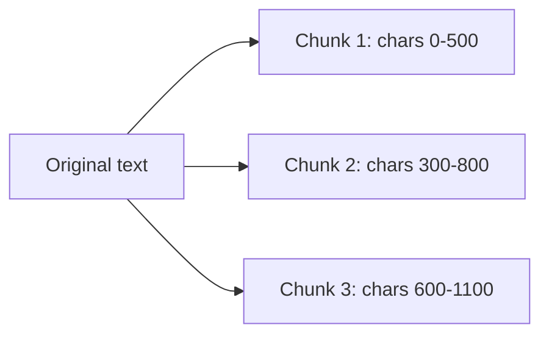
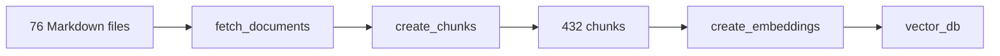

# 03 - Chunking Strategies

## Why Chunking Exists

Retrieval does not usually return whole books or whole folders. It returns smaller pieces of text. Those pieces are called chunks.

Chunking exists because documents are often too large or too mixed-topic to retrieve as one unit. A contract might contain pricing, renewal terms, support terms, and features. If the whole contract is embedded as one vector, a pricing question might be diluted by unrelated text.

A chunk is the unit of retrieval. That means chunk quality strongly affects answer quality.

## The Chunking Tradeoff

| Chunk choice | What can go wrong |
|--------------|-------------------|
| Too large | The embedding mixes many topics, so retrieval is less precise. |
| Too small | The chunk may omit nearby context needed to answer correctly. |
| No overlap | A fact split across a boundary may be missing from both useful chunks. |
| Too much overlap | The database grows, retrieval can return near-duplicates, and cost rises. |

Good chunking tries to keep each chunk focused while preserving enough context.

## Baseline Chunking

The baseline code in [`implementation/ingest.py`](../rag-system/implementation/ingest.py) uses LangChain's `RecursiveCharacterTextSplitter`:

```python
CHUNK_SIZE = 500
CHUNK_OVERLAP = 200

splitter = RecursiveCharacterTextSplitter(
    chunk_size=CHUNK_SIZE,
    chunk_overlap=CHUNK_OVERLAP,
)
chunks = splitter.split_documents(documents)
```

This means:

- each chunk targets about 500 characters,
- adjacent chunks repeat about 200 characters,
- splitting is deterministic and cheap.

It uses characters, not tokens. That is acceptable for a teaching baseline, but production systems often tune by tokens or by document structure.

## Why Overlap Helps

Imagine a sentence crosses a boundary:

```text
Chunk 1 ending: ... Maxine Thompson won the Insurellm
Chunk 2 beginning: Innovator of the Year award in 2023 ...
```

Without overlap, neither chunk contains the complete fact. With overlap, at least one neighboring chunk is more likely to contain the full sentence.



The repeated regions are not a bug. They are a retrieval safety margin.

## Minimal Splitting Example

```python
from langchain_text_splitters import RecursiveCharacterTextSplitter

text = "A" * 600
splitter = RecursiveCharacterTextSplitter(chunk_size=500, chunk_overlap=200)
parts = splitter.split_text(text)

print("num_parts", len(parts))
print("len0", len(parts[0]), "len1", len(parts[1]))
```

Example output:

```text
num_parts 2
len0 500 len1 300
```

The second chunk starts before the first chunk fully ends because of overlap.

## Chunking In The Baseline Lifecycle

Run:

```bash
python -m implementation.ingest
```

The lifecycle is:



Example output:

```text
Loaded 76 source documents
Created 432 chunks (size=500, overlap=200)
There are 432 vectors with 3,072 dimensions in the vector store
Ingestion complete
```

The exact number of chunks depends on the source files and splitter settings.

## Metadata Survives Chunking

When `fetch_documents()` loads a file, it adds metadata:

```python
doc.metadata["doc_type"] = doc_type
```

After splitting, each chunk still carries metadata such as:

- `source`: the original file path,
- `doc_type`: the parent folder such as `company`, `products`, `contracts`, or `employees`.

That is why the chat app can show where retrieved context came from.

## Advanced Chunking

The advanced ingest path in [`pro_implementation/ingest.py`](../rag-system/pro_implementation/ingest.py) uses an LLM to create structured chunks.

For each source document, the LLM returns chunks with:

| Field | Purpose |
|-------|---------|
| `headline` | Short phrase likely to match user search language. |
| `summary` | Compact paraphrase of what the chunk contains. |
| `original_text` | Verbatim source text so facts are preserved. |

Then `Chunk.as_result()` combines those fields:

```python
page_content = headline + "\n\n" + summary + "\n\n" + original_text
```

This makes each stored chunk more retrieval-friendly because it contains both original wording and a summary phrased for search.

## Baseline Vs Advanced Chunking

| Approach | Why use it | Cost | Risk |
|----------|------------|------|------|
| Fixed-size splitter | Simple, fast, deterministic. | Low. | May split in awkward places. |
| LLM-authored chunks | Can align chunks with human questions. | Higher. | Requires model calls and quality checks. |

The baseline is easier to reason about. The advanced path is closer to what teams may explore when retrieval quality becomes a bottleneck.

## What To Remember

- Chunks are the pieces retrieval returns.
- Chunking quality controls what evidence the model can see.
- Overlap protects facts that land near chunk boundaries.
- The baseline uses fixed-size chunks; the advanced system creates richer LLM-authored chunks.

Next: [`04-retrieval-pipelines-and-similarity-search.md`](04-retrieval-pipelines-and-similarity-search.md)
