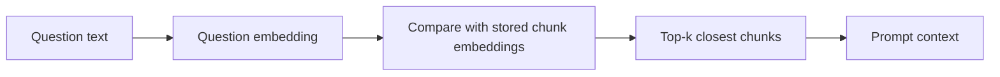
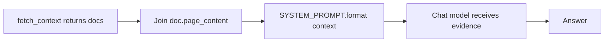

# 04 - Retrieval Pipelines And Similarity Search

## What Retrieval Means

Retrieval is the step that chooses evidence for a question.

The user asks:

```text
How many employees does Insurellm currently have?
```

The retriever returns chunks that probably contain the answer, such as a chunk from `company/overview.md`.

The retriever does not write the final answer. It only selects context.

## The Retrieval Pipeline



In the baseline code, this pipeline is mostly hidden inside LangChain's retriever object:

```python
vectorstore = Chroma(persist_directory=DB_NAME, embedding_function=embeddings)
retriever = vectorstore.as_retriever(search_kwargs={"k": RETRIEVAL_K})
docs = retriever.invoke(question)
```

That `invoke()` call embeds the query, searches Chroma, and returns matching `Document` objects.

## What Is Top-k?

`k` means "how many chunks should retrieval return?"

In [`implementation/answer.py`](../rag-system/implementation/answer.py):

```python
RETRIEVAL_K = 10
```

So the baseline retriever returns 10 chunks for each retrieval query.

Choosing `k` is a tradeoff:

| Smaller `k` | Larger `k` |
|-------------|------------|
| Faster, cheaper prompt, less noise. | More chance the answer is included. |
| More likely to miss supporting evidence. | More text for the LLM to sift through. |

## Similarity Search

The vector database compares the question vector to stored chunk vectors. The most similar vectors are considered the best matches.

You can think of it as asking:

> Which stored chunks are closest in meaning to this question?

This is why an embedding retriever can match "automobile coverage" with "Carllm auto insurance portal" even if the exact words differ.

## The Shape Of A Retrieved Document

`fetch_context()` returns a list of LangChain `Document` objects.

Each object has two important fields:

| Field | Meaning |
|-------|---------|
| `page_content` | The chunk text that may be placed into the prompt. |
| `metadata` | Source information such as file path and document type. |

That is why `app.py` can display:

```python
doc.metadata["source"]
doc.page_content
```

The model receives `page_content`. Humans debugging the system need `metadata`.

## Running A Retrieval Check

After running baseline ingest, you can inspect retrieval:

```python
from implementation.answer import fetch_context

docs = fetch_context("How many employees does Insurellm have?")
print("retrieved", len(docs))
print("first source:", docs[0].metadata.get("source"))
print("preview:", docs[0].page_content[:120].replace("\n", " "))
```

Example output:

```text
retrieved 10
first source: .../knowledge-base/company/overview.md
preview: # Insurellm Overview Insurellm is an insurance technology company ...
```

This tells you retrieval is finding company overview content for a company headcount question.

## Multi-Turn Questions

Users often ask follow-up questions:

```text
User: Tell me about our products.
Assistant: ...
User: Which one is for auto insurers?
```

The latest question, "Which one is for auto insurers?", is ambiguous by itself. The baseline code uses `combined_question()` to include prior user turns in the retrieval query:

```python
history = [
    {"role": "user", "content": "Tell me about our products."},
    {"role": "assistant", "content": "We offer several product lines..."},
]

combined = combined_question("Which one is for auto insurers?", history)
print(combined)
```

Example output:

```text
Tell me about our products.
Which one is for auto insurers?
```

Important detail: this combined string is used for retrieval. The final LLM call still receives structured chat messages for generation.

## Dense, Sparse, And Hybrid Retrieval

This module focuses on dense retrieval.

| Retrieval type | How it searches | Example |
|----------------|-----------------|---------|
| Sparse | Exact or weighted keyword matching. | BM25 keyword search. |
| Dense | Embedding similarity. | Chroma vector search. |
| Hybrid | Combines sparse and dense signals. | BM25 plus embeddings. |

Dense retrieval is easier to teach with embeddings. Production systems often add sparse or hybrid retrieval when exact names, IDs, numbers, and rare terms matter.

## How Retrieval Connects To Generation

Retrieval output becomes prompt input:



The model can only use what the retrieval step provides plus its own general reasoning. If retrieval misses the right chunk, generation becomes much harder.

## What To Remember

- Retrieval selects evidence; generation writes the answer.
- `RETRIEVAL_K` controls how many chunks the baseline retrieves.
- Retrieved `Document` objects carry both text and source metadata.
- `combined_question()` helps follow-up questions retrieve the right context.

Next: [`05-building-the-basic-rag-pipeline.md`](05-building-the-basic-rag-pipeline.md)
