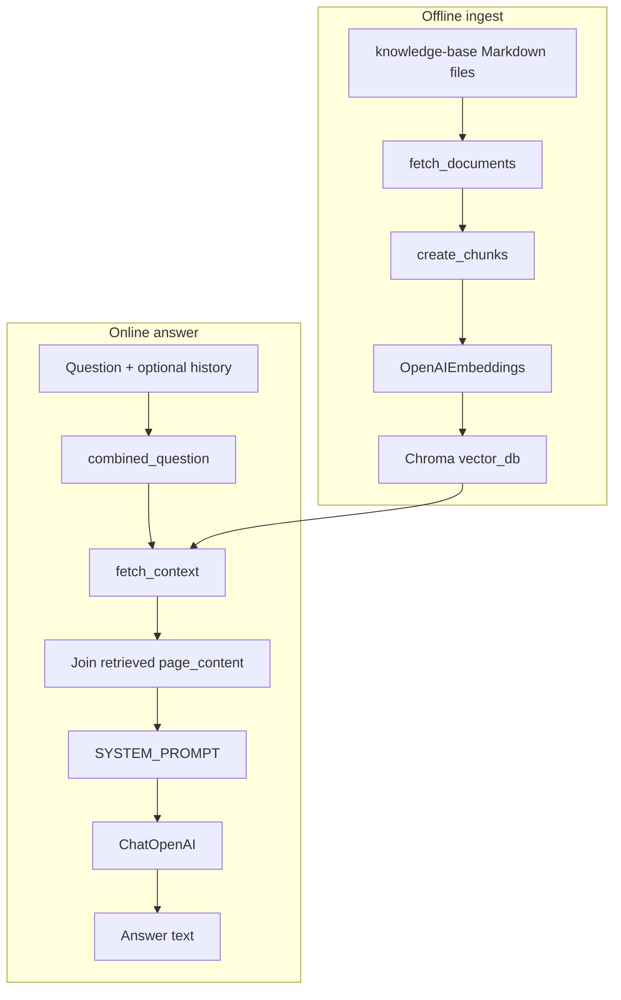
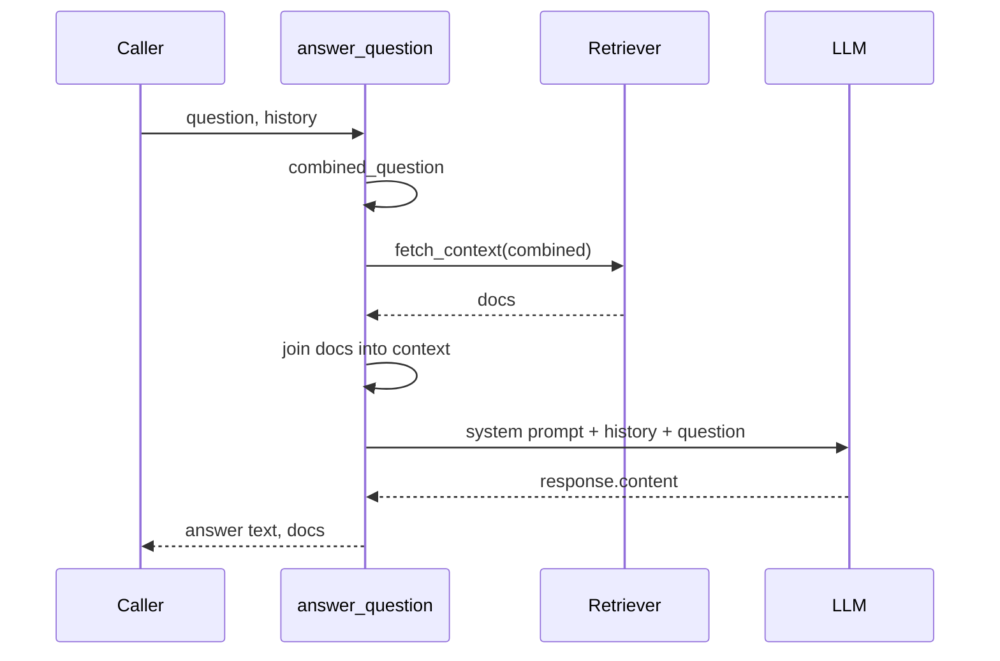

# 05 - Building The Baseline RAG Pipeline

## What This Guide Teaches

This guide connects the concepts from guides 01-04 to the actual baseline code:

- [`implementation/ingest.py`](../rag-system/implementation/ingest.py)
- [`implementation/answer.py`](../rag-system/implementation/answer.py)

The baseline system is the main implementation used by:

- [`app.py`](../rag-system/app.py),
- [`evaluation/eval.py`](../rag-system/evaluation/eval.py),
- [`examples/03_basic_rag_demo.py`](../rag-system/examples/03_basic_rag_demo.py),
- [`examples/04_evaluation_demo.py`](../rag-system/examples/04_evaluation_demo.py).

## The Whole Baseline Architecture



There are two different time periods:

- Ingest time: build `vector_db/`.
- Question time: read `vector_db/` and answer one user question.

## Step 1: Ingest Builds The Searchable Library

Run from `rag-system/`:

```bash
python -m implementation.ingest
```

This script does not answer questions. It prepares the database that answering will use later.

### Important Constants

```python
RAG_ROOT = Path(__file__).resolve().parent.parent
KNOWLEDGE_BASE_DIR = RAG_ROOT / "knowledge-base"
VECTOR_DB_DIR = os.environ.get("INSURELLM_VECTOR_DB", str(RAG_ROOT / "vector_db"))

CHUNK_SIZE = 500
CHUNK_OVERLAP = 200
EMBEDDING_MODEL = "text-embedding-3-large"
```

What these mean:

| Constant | Why it exists |
|----------|---------------|
| `RAG_ROOT` | Finds the `rag-system/` folder no matter where Python is launched from. |
| `KNOWLEDGE_BASE_DIR` | Points to the Markdown files that contain the source facts. |
| `VECTOR_DB_DIR` | Points to the Chroma database directory. Can be overridden with `INSURELLM_VECTOR_DB`. |
| `CHUNK_SIZE` | Controls target chunk length. |
| `CHUNK_OVERLAP` | Repeats text across neighboring chunks to protect boundary facts. |
| `EMBEDDING_MODEL` | Chooses the OpenAI embedding model used for chunk vectors. |

### `fetch_documents()`

Purpose: load all Markdown files under `knowledge-base/`.

Simplified flow:

```python
folders = glob.glob(str(KNOWLEDGE_BASE_DIR / "*"))
documents = []

for folder in folders:
    doc_type = os.path.basename(folder)
    loader = DirectoryLoader(folder, glob="**/*.md", loader_cls=TextLoader)
    folder_docs = loader.load()
    for doc in folder_docs:
        doc.metadata["doc_type"] = doc_type
        documents.append(doc)
```

What enters:

- folders such as `company/`, `products/`, `contracts/`, `employees/`.

What exits:

- a list of LangChain `Document` objects.

Each document contains:

- `page_content`: the full Markdown text,
- `metadata`: details such as source path and `doc_type`.

Why `doc_type` matters: it lets later code know whether a chunk came from company, product, contract, or employee data.

### `create_chunks(documents)`

Purpose: split full documents into retrieval-sized units.

```python
splitter = RecursiveCharacterTextSplitter(
    chunk_size=CHUNK_SIZE,
    chunk_overlap=CHUNK_OVERLAP,
)
return splitter.split_documents(documents)
```

What enters:

- full-document `Document` objects.

What exits:

- smaller `Document` chunks.

The metadata stays attached to the chunks. That is why a retrieved chunk can still tell you which source file it came from.

### `create_embeddings(chunks)`

Purpose: embed chunks and persist them to Chroma.

```python
if os.path.exists(VECTOR_DB_DIR):
    Chroma(persist_directory=VECTOR_DB_DIR, embedding_function=embeddings).delete_collection()

vectorstore = Chroma.from_documents(
    documents=chunks,
    embedding=embeddings,
    persist_directory=VECTOR_DB_DIR,
)
```

What enters:

- chunk `Document` objects.

What happens:

1. Existing Chroma collection is deleted if the database directory already exists.
2. Each chunk's `page_content` is sent to the embedding model.
3. Chroma stores chunk text, vector, and metadata.

What exits:

- a persistent database in `vector_db/`.

Example output:

```text
Loaded 76 source documents
Created 432 chunks (size=500, overlap=200)
There are 432 vectors with 3,072 dimensions in the vector store
Ingestion complete
```

This confirms that the searchable library exists.

## Step 2: Answering Uses The Searchable Library

The answering code lives in [`implementation/answer.py`](../rag-system/implementation/answer.py).

At import time, it creates three important objects:

```python
embeddings = OpenAIEmbeddings(model=EMBEDDING_MODEL)
vectorstore = Chroma(persist_directory=DB_NAME, embedding_function=embeddings)
retriever = vectorstore.as_retriever(search_kwargs={"k": RETRIEVAL_K})
llm = ChatOpenAI(temperature=0, model_name=CHAT_MODEL)
```

What each object does:

| Object | Job |
|--------|-----|
| `embeddings` | Embeds user queries so they can be compared with stored chunk vectors. |
| `vectorstore` | Opens the persisted Chroma database. |
| `retriever` | Returns the top `RETRIEVAL_K` chunks for a query. |
| `llm` | Generates the final natural language answer. |

Important: `answer.py` assumes `vector_db/` already exists. Run ingest before running the app or demos.

## `fetch_context(question)`

```python
def fetch_context(question: str) -> list[Document]:
    return retriever.invoke(question)
```

This small function hides a lot of work:

1. Embed the question.
2. Compare it to stored vectors in Chroma.
3. Return the top matching chunks as `Document` objects.

The returned documents are the evidence candidates.

## `combined_question(question, history)`

```python
history = history or []
prior = "\n".join(m["content"] for m in history if m.get("role") == "user")
return (prior + "\n" + question).strip()
```

This function is for retrieval, not for final chat formatting.

Why it exists:

- A follow-up question may depend on earlier user messages.
- Combining prior user turns gives retrieval more words to search with.

Example:

```text
Tell me about our products.
Which one is for auto insurers?
```

That combined query is more informative than "Which one is for auto insurers?" by itself.

## `answer_question(question, history)`

This is the main baseline function.



Line-by-line meaning:

```python
history = history or []
```

Normalize missing history to an empty list.

```python
combined = combined_question(question, history)
```

Build the retrieval query from prior user turns plus the latest question.

```python
docs = fetch_context(combined)
```

Retrieve the top matching chunks.

```python
context = "\n\n".join(doc.page_content for doc in docs)
```

Create one context block from the retrieved chunk text.

```python
system_prompt = SYSTEM_PROMPT.format(context=context)
```

Insert retrieved evidence into the system prompt.

```python
messages = [SystemMessage(content=system_prompt)]
messages.extend(convert_to_messages(history))
messages.append(HumanMessage(content=question))
```

Build the final chat message list:

1. system message with retrieved context,
2. prior conversation,
3. latest user question.

```python
response = llm.invoke(messages)
return response.content, docs
```

Ask the chat model to answer and return both the answer and retrieved documents.

Returning `docs` is important. It lets the UI and evaluation tools inspect what evidence was used.

## What The Model Actually Sees

The system prompt has this shape:

```text
You are a knowledgeable, friendly assistant representing the company Insurellm.
You are chatting with a user about Insurellm.
If relevant, use the given context to answer any question.
If you don't know the answer, say so.
Context:
<retrieved chunk 1>

<retrieved chunk 2>

...
```

Then the model receives the prior chat messages and the latest user question.

That is prompt augmentation: retrieved text is inserted into the model request before generation.

## How The App Uses This Function

[`app.py`](../rag-system/app.py) calls:

```python
answer, context = answer_question(last_message, prior)
```

Then it:

- appends the answer to the chat history,
- formats retrieved chunks in the context panel.

This makes retrieval visible. If the answer is wrong, first inspect whether the right chunks appeared in the side panel.

## How Evaluation Uses This Function

[`evaluation/eval.py`](../rag-system/evaluation/eval.py) imports:

```python
from implementation.answer import answer_question, fetch_context
```

That means the evaluation harness measures the baseline implementation by default.

- `evaluate_retrieval()` calls `fetch_context()`.
- `evaluate_answer()` calls `answer_question()`.

If you modify `pro_implementation`, these evaluation scores do not change unless you update the imports.

## Run The Baseline Demo

```bash
python examples/03_basic_rag_demo.py
```

Example output:

```text
Question: How many employees does Insurellm currently have?

Top sources:
  1. .../knowledge-base/company/overview.md
     # Insurellm Overview ...

Answer:
 Insurellm currently has 32 employees.
```

Read the output in two layers:

- Top sources show whether retrieval found useful evidence.
- Answer shows whether generation used that evidence correctly.

## Debugging The Baseline

| Symptom | First place to check | Why |
|---------|----------------------|-----|
| App says it cannot find facts | Did you run `python -m implementation.ingest`? | `answer.py` needs `vector_db/`. |
| Answer is wrong | Inspect retrieved docs from `answer_question()`. | Bad answers often start with bad retrieval. |
| Sources look irrelevant | Try changing chunk size, overlap, or query wording. | Retrieval quality depends on chunks and embeddings. |
| Evaluation did not change after pro edits | Check imports in `evaluation/eval.py`. | Evaluation uses baseline imports. |

## What To Remember

- `ingest.py` writes the vector database.
- `answer.py` reads the vector database.
- `answer_question()` is the central baseline function.
- The app and evaluator both depend on the baseline path.
- The model answer is only as grounded as the retrieved context it receives.

Next: [`06-advanced-rag-query-rewriting-and-reranking.md`](06-advanced-rag-query-rewriting-and-reranking.md)
