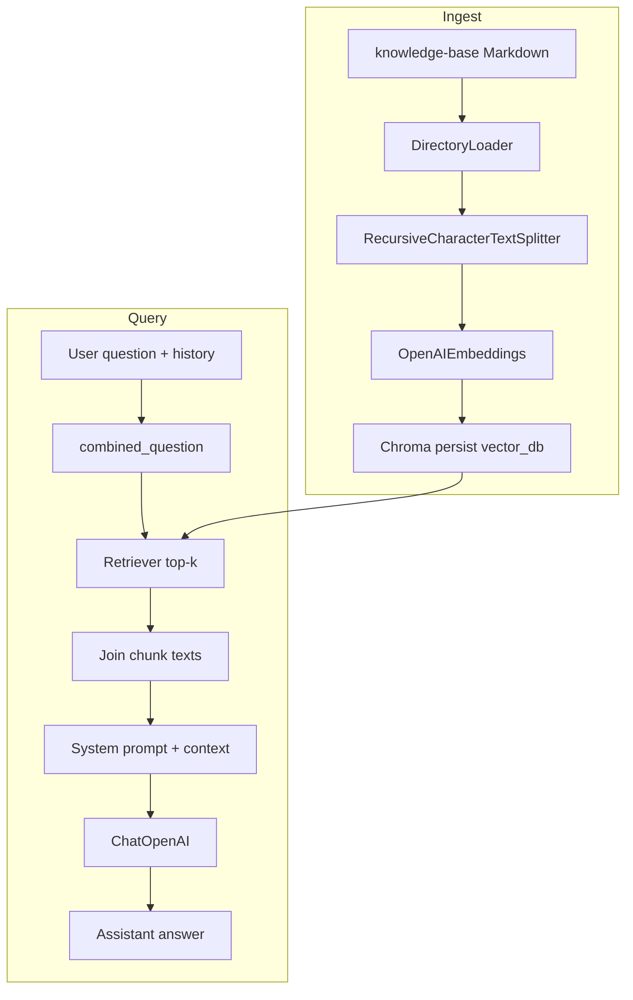

# 05 — Building the baseline RAG pipeline

## What this guide is about

End-to-end **ingest → store → retrieve → prompt → answer** for the Insurellm assistant using [`implementation/ingest.py`](../rag-system/implementation/ingest.py) and [`implementation/answer.py`](../rag-system/implementation/answer.py).

## Architecture (mermaid)



## Step 1 — Ingest (`implementation/ingest.py`)

Key functions:

| Function | Role |
|----------|------|
| `fetch_documents()` | Walk `knowledge-base/*/*.md`, attach `doc_type` metadata. |
| `create_chunks()` | Split each document with overlap. |
| `create_embeddings()` | Reset collection, embed all chunks, persist to `vector_db/`. |

Run:

```bash
cd rag-system
python -m implementation.ingest
```

**Example output:**

```text
Loaded 76 source documents
Created 432 chunks (size=500, overlap=200)
There are 432 vectors with 3,072 dimensions in the vector store
Ingestion complete
```

What this output tells you: the KB is now searchable via embeddings.

### Snippet walkthrough — where the DB path comes from

```python
from pathlib import Path
RAG_ROOT = Path(__file__).resolve().parent.parent
VECTOR_DB_DIR = RAG_ROOT / "vector_db"
print(VECTOR_DB_DIR)
```

**Example output:**

```text
/Users/.../rag-system/vector_db
```

What this output tells you: Chroma files live **beside** your code under `rag-system/vector_db/`. You can override with env `INSURELLM_VECTOR_DB` (see `ingest.py`).

## Step 2 — Answer (`implementation/answer.py`)

Pipeline inside `answer_question`:

1. `combined_question(question, history)` → one string for retrieval.
2. `fetch_context(combined)` → `retriever.invoke(...)` returns `Document` list.
3. Build `SYSTEM_PROMPT` with joined `page_content`.
4. `convert_to_messages(history)` + final `HumanMessage(question)`.
5. `llm.invoke(messages)` → assistant string.

Quick demo:

```bash
cd rag-system
python examples/03_basic_rag_demo.py
```

**Example output:**

```text
Question: How many employees does Insurellm currently have?

Top sources:
  1. .../knowledge-base/company/overview.md
     # Insurellm Overview ...
  2. .../knowledge-base/company/about.md
     ...
  3. .../knowledge-base/employees/...

Answer:
 Insurellm currently has 32 employees.
```

What this output tells you: retrieval surfaced company overview / HR-like sources; the model **stitched** an answer grounded in those chunks.

## What the model “sees” (shape of the prompt)

The system message is literally:

```text
You are a knowledgeable, friendly assistant representing the company Insurellm.
...
Context:
<chunk1>

<chunk2>
...
```

The **user** message is only the latest question — earlier turns arrive via `convert_to_messages` as prior user/assistant pairs.

## Line-by-line table — `fetch_context`

| Line idea | Meaning |
|-----------|---------|
| `as_retriever(search_kwargs={"k": RETRIEVAL_K})` | Fixes how many neighbors to pull. |
| `retriever.invoke(question)` | Runs embedding + similarity search inside LangChain/Chroma. |

## What to remember

- **Ingest** creates the evidence store; **answer** selects evidence per query.
- **History** changes retrieval via `combined_question`, not only generation.

Next: [`06-advanced-rag-query-rewriting-and-reranking.md`](06-advanced-rag-query-rewriting-and-reranking.md)
