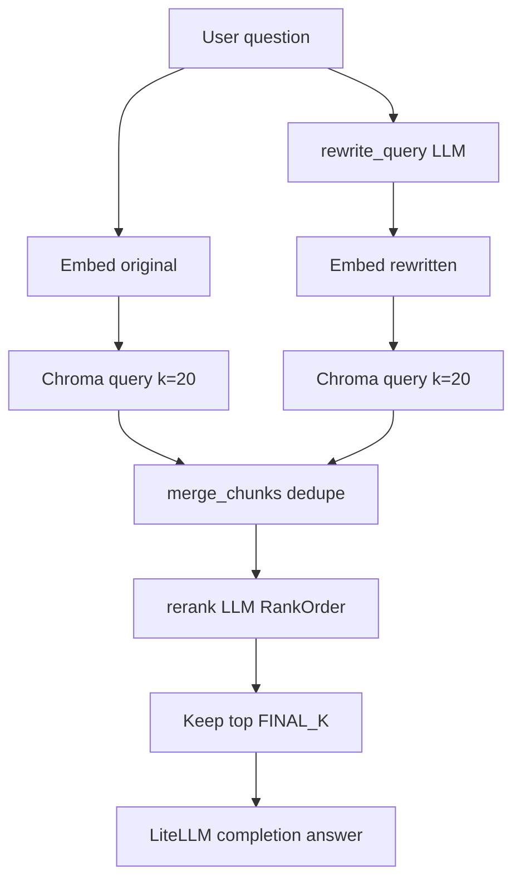

# 06 — Advanced RAG: query rewriting and reranking

## What this guide is about

When **dense retrieval** misses relevant chunks, it is often because the **user’s words** do not match the **document’s words**. This guide covers **query rewriting**, **dual-query retrieval**, and **LLM reranking** as implemented in [`pro_implementation/answer.py`](../rag-system/pro_implementation/answer.py).

## Failure mode example

User: “Who runs marketing?”  
Document: “**Head of Brand Strategy**: Jordan Blake …”

A single embedding of the question may not land near the chunk because “marketing” ≠ “brand strategy.” **Rewriting** the question to “Who is the head of brand strategy at Insurellm?” can fix that mismatch.

## Architecture (mermaid)



## Functions you should know

| Function | Role |
|----------|------|
| `rewrite_query` | Produces a short KB-optimized search string. |
| `fetch_context_unranked` | Embedding + `collection.query` for `RETRIEVAL_K` results. |
| `merge_chunks` | Union of two lists without duplicate `page_content`. |
| `rerank` | LLM returns a permutation of chunk IDs; we reorder results. |
| `fetch_context` | Orchestrates rewrite + dual retrieval + rerank + `FINAL_K`. |

## Run the advanced demo

Requires `preprocessed_db` (run `python -m pro_implementation.ingest` first — costs LLM calls).

```bash
cd rag-system
python examples/05_advanced_rag_demo.py
```

**Example output:**

```text
Question: Who is responsible for brand strategy leadership?
Rewritten KB query: Who is the Head of Brand Strategy at Insurellm?

Fetched 10 reranked chunks. First source:
 .../knowledge-base/employees/Jordan Blake.md
 Jordan Blake ... Head of Brand Strategy ...

Answer:
 Jordan Blake leads brand strategy as Head of Brand Strategy.
```

What this output tells you: the rewriter surfaced **role language** that exists in the employee profile; reranking kept the best chunk near the top.

## Ingest side — LLM chunking

See guide 03 for the intuition. Running ingest:

```bash
cd rag-system
python -m pro_implementation.ingest
```

**Example output:**

```text
Loaded 76 documents
Vectorstore created with 512 documents
Ingestion complete
```

What this output tells you: chunk count differs from the baseline splitter because the LLM decides boundaries.

## Configuration knobs

| Env / constant | Default | Meaning |
|----------------|---------|---------|
| `INSURELLM_PRO_CHAT_MODEL` | `openai/gpt-4.1-nano` | LiteLLM route for rewrite/rerank/answer. |
| `RETRIEVAL_K` | 20 | Candidates per query embedding. |
| `FINAL_K` | 10 | Chunks passed to the answering prompt. |

## What to remember

- **Rewrite** aligns user language with document language.
- **Dual retrieval** widens recall; **rerank** sharpens precision.
- Advanced path uses **`preprocessed_db`**, separate from baseline `vector_db/`.

Next: [`07-evaluating-rag-systems.md`](07-evaluating-rag-systems.md)
