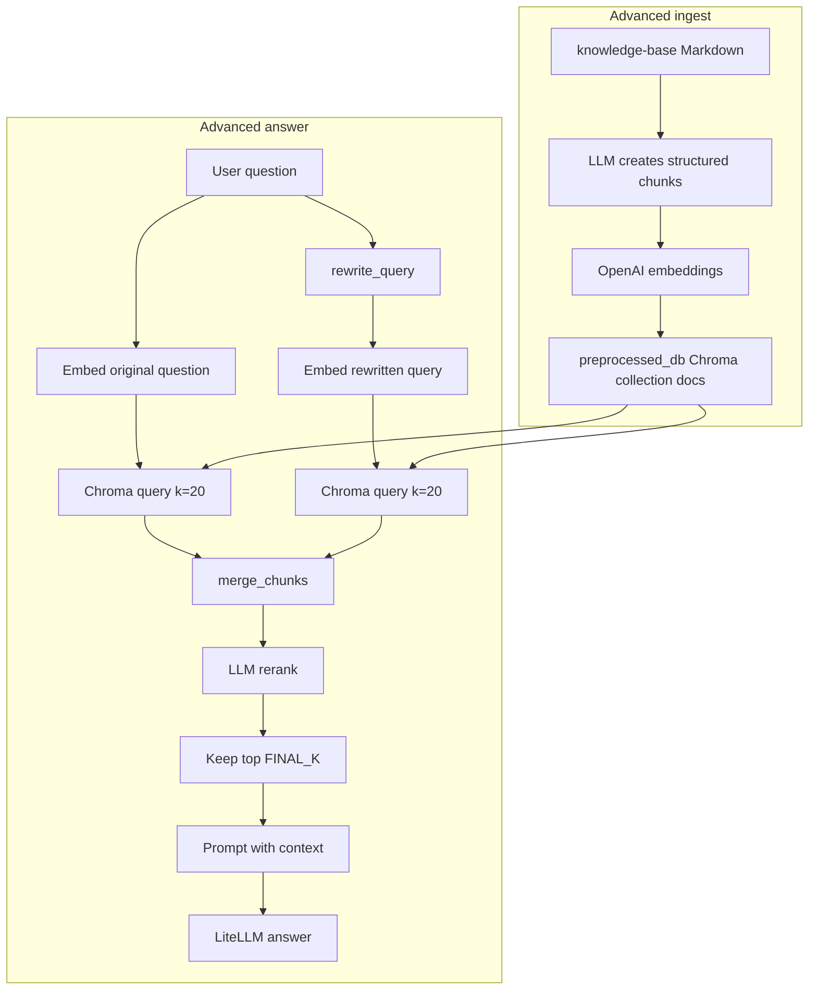

# 06 - Advanced RAG: Query Rewriting And Reranking

## Why Advanced RAG Exists

The baseline RAG system is useful and easy to understand, but it can fail in predictable ways:

- The user uses different words than the document.
- The right chunk appears in the top 20 but not the top 10.
- Several chunks are loosely related, and the best one is not ranked first.
- Fixed-size chunks split information in awkward places.

The advanced implementation explores ways to improve retrieval quality:

1. LLM-authored chunks during ingest.
2. Query rewriting before search.
3. Two retrieval searches instead of one.
4. LLM reranking before answer generation.

This code lives in [`pro_implementation/`](../rag-system/pro_implementation/).

## Baseline Vs Advanced At A Glance

| Part | Baseline | Advanced |
|------|----------|----------|
| Ingest file | `implementation/ingest.py` | `pro_implementation/ingest.py` |
| Chunking | Fixed character chunks | LLM-authored chunks with headline, summary, original text |
| Database | `vector_db/` | `preprocessed_db/` |
| Retrieval API | LangChain retriever | Native Chroma client |
| Query handling | Combined user turns | Rewrite current question into KB search language |
| Reranking | None | LLM returns relevance order |
| Chat provider wrapper | LangChain `ChatOpenAI` | LiteLLM `completion` |

The advanced stack is not automatically used by `app.py` or `evaluation/eval.py`.

## Advanced Architecture



## Advanced Ingest: `pro_implementation/ingest.py`

Baseline ingest splits by character count. Advanced ingest asks an LLM to split each document into chunks that are more meaningful for questions.

### Source Documents

```python
def fetch_documents():
    documents = []
    for folder in KNOWLEDGE_BASE_PATH.iterdir():
        ...
        documents.append({"type": doc_type, "source": file.as_posix(), "text": f.read()})
```

Instead of LangChain `Document` objects, the advanced ingest uses plain dictionaries:

| Key | Meaning |
|-----|---------|
| `type` | Folder name such as `employees` or `contracts`. |
| `source` | Full source file path. |
| `text` | Full Markdown file content. |

### LLM Chunk Schema

The advanced chunk schema is:

```python
class Chunk(BaseModel):
    headline: str
    summary: str
    original_text: str
```

Why each field exists:

| Field | Why it helps retrieval |
|-------|------------------------|
| `headline` | Gives the chunk a short label that may match user queries. |
| `summary` | Adds a concise paraphrase of the chunk's meaning. |
| `original_text` | Preserves source wording and exact facts. |

Then `as_result()` turns each chunk into:

```python
page_content = headline + "\n\n" + summary + "\n\n" + original_text
metadata = {"source": document["source"], "type": document["type"]}
```

The embedded text is richer than raw source text alone.

### Parallel Processing

```python
with Pool(processes=WORKERS) as pool:
    for result in tqdm(pool.imap_unordered(process_document, documents), total=len(documents)):
        chunks.extend(result)
```

This speeds up LLM chunking by processing multiple documents at once. If rate limits occur, reduce workers:

```bash
export INSURELLM_INGEST_WORKERS=1
```

### Storing Advanced Chunks

```python
chroma = PersistentClient(path=DB_NAME)
collection = chroma.get_or_create_collection(COLLECTION_NAME)
collection.add(ids=ids, embeddings=vectors, documents=texts, metadatas=metas)
```

The advanced path uses Chroma's native client and stores documents in a collection named `docs`.

Run:

```bash
python -m pro_implementation.ingest
```

Example output:

```text
Loaded 76 documents
Total chunks after LLM preprocessing: 512
Vectorstore created with 512 documents
Ingestion complete
```

## Advanced Answering: `pro_implementation/answer.py`

The main function is still `answer_question()`, but it calls more retrieval steps before generation.

## Query Rewriting

Problem: user language may not match document language.

Example:

| User asks | Better search query |
|-----------|---------------------|
| Who runs marketing? | Who is Head of Brand Strategy at Insurellm? |
| Which product is for cars? | What is Carllm? |
| Who handles claims automation? | Which employee or product leads Claimllm claims automation? |

`rewrite_query()` asks the chat model to produce a short knowledge-base search query:

```python
response = completion(model=CHAT_MODEL, messages=[{"role": "system", "content": message}])
return response.choices[0].message.content
```

The rewritten query is not shown to the end user. It is an internal search helper.

## Dual-Query Retrieval

`fetch_context()` searches twice:

```python
rewritten_question = rewrite_query(original_question)
chunks1 = fetch_context_unranked(original_question)
chunks2 = fetch_context_unranked(rewritten_question)
chunks = merge_chunks(chunks1, chunks2)
```

Why search twice?

- The original question may contain useful exact names or numbers.
- The rewritten query may contain better domain wording.
- Combining both increases recall, meaning the system has a better chance of finding the right evidence.

## Native Chroma Query

`fetch_context_unranked()` performs the lower-level retrieval:

```python
query = openai_client.embeddings.create(
    model=EMBEDDING_MODEL,
    input=[question],
).data[0].embedding

results = collection.query(query_embeddings=[query], n_results=RETRIEVAL_K)
```

Unlike the baseline LangChain retriever, this code shows the two steps explicitly:

1. Create the query embedding.
2. Ask Chroma for nearest chunks.

It then converts Chroma results into `Result` objects with:

- `page_content`,
- `metadata`.

## Merging Results

Two searches can return the same chunk. `merge_chunks()` removes duplicates by `page_content`:

```python
if chunk.page_content not in existing:
    merged.append(chunk)
```

This keeps the candidate list wider without sending identical chunks into reranking.

## Reranking

Initial vector retrieval is fast but approximate. Reranking asks an LLM to read the candidate chunks and order them by relevance to the question.

```python
class RankOrder(BaseModel):
    order: list[int]
```

The prompt gives each chunk an ID. The model returns a structured list such as:

```json
{"order": [3, 1, 7, 2, 4, 5, 6]}
```

Then the code maps those IDs back to the chunk objects:

```python
return [chunks[i - 1] for i in order]
```

Finally, `fetch_context()` keeps:

```python
return reranked[:FINAL_K]
```

By default:

- `RETRIEVAL_K = 20` per search,
- `FINAL_K = 10` chunks passed to the answer prompt.

## Final Answer Generation

`make_rag_messages()` builds the prompt:

```python
context = "\n\n".join(
    f"Extract from {chunk.metadata['source']}:\n{chunk.page_content}"
    for chunk in chunks
)
```

This advanced prompt includes the source path before each chunk. Then `answer_question()` calls:

```python
response = completion(model=CHAT_MODEL, messages=messages)
```

The answer is generated with LiteLLM rather than LangChain `ChatOpenAI`.

## Current History Behavior

The advanced `rewrite_query()` function accepts optional `history`, but the current `fetch_context()` call uses only the latest question when it rewrites and retrieves. The final prompt can still receive `history` through `make_rag_messages()`.

That means:

- baseline retrieval uses prior user turns through `combined_question()`,
- advanced retrieval currently focuses on the latest question,
- advanced generation can still include prior chat messages.

This is an important implementation detail if you extend the pro stack.

## Running The Advanced Demo

First build `preprocessed_db/`:

```bash
python -m pro_implementation.ingest
```

Then run:

```bash
python examples/05_advanced_rag_demo.py
```

Example output:

```text
Question: Who is responsible for brand strategy leadership?
Rewritten KB query: Who is the Head of Brand Strategy at Insurellm?

Fetched 10 reranked chunks. First source:
 .../knowledge-base/employees/Jordan Blake.md
 Jordan Blake ... Head of Brand Strategy ...

Answer:
 Jordan Blake leads brand strategy as Head of Brand Strategy.
```

## Tradeoffs

| Technique | Benefit | Cost or risk |
|-----------|---------|--------------|
| LLM chunking | More meaningful chunks. | Slower ingest, higher cost, possible variability. |
| Query rewriting | Better match between user wording and document wording. | Extra model call, possible bad rewrite. |
| Dual retrieval | Higher recall. | More candidates, more latency. |
| Reranking | Better final ordering. | Extra model call and prompt tokens. |
| LiteLLM routing | Easier provider swaps. | Provider-specific auth and behavior still matter. |

## What To Remember

- Advanced RAG improves retrieval by widening candidate search and then reordering candidates.
- `preprocessed_db/` is separate from baseline `vector_db/`.
- The default app and evaluation harness do not use the advanced stack.
- Every advanced improvement has a cost in latency, money, complexity, or evaluation burden.

Next: [`07-evaluating-rag-systems.md`](07-evaluating-rag-systems.md)
