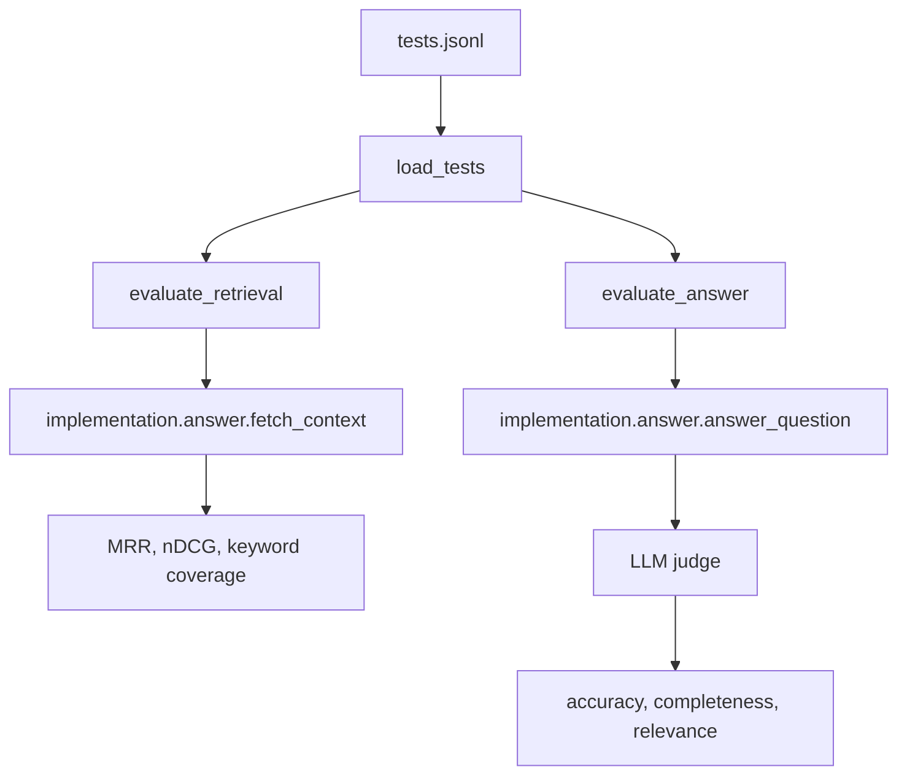
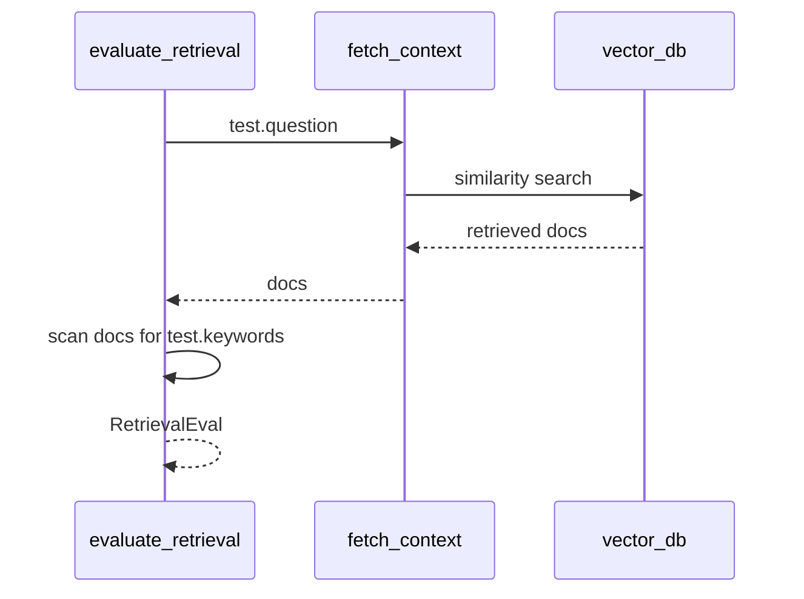

# 07 - Evaluating RAG Systems

## Why RAG Evaluation Is Different

A RAG answer can fail in more than one place.

| Failure location | Example |
|------------------|---------|
| Retrieval fails | The right source chunk is never returned. |
| Prompting fails | The right chunk is returned, but the prompt does not make the model use it. |
| Generation fails | The model reads the context but answers incorrectly or incompletely. |
| Evaluation fails | The metric says "good" even though a human would disagree. |

Because of this, the module measures retrieval and answers separately.

## The Evaluation Flow



Important: this flow imports the baseline implementation:

```python
from implementation.answer import answer_question, fetch_context
```

So the default evaluation harness measures `implementation/`, not `pro_implementation/`.

## The Test File

The test suite is [`evaluation/tests.jsonl`](../rag-system/evaluation/tests.jsonl). It contains 150 JSON lines. Each line is one test case.

Example row:

```json
{
  "question": "Who won the prestigious IIOTY award in 2023?",
  "keywords": ["Maxine", "Thompson", "IIOTY"],
  "reference_answer": "Maxine Thompson won the prestigious Insurellm Innovator of the Year (IIOTY) award in 2023.",
  "category": "direct_fact"
}
```

Each field has a job:

| Field | Used for | Meaning |
|-------|----------|---------|
| `question` | Retrieval and answer generation. | The user-like input. |
| `keywords` | Retrieval metrics. | Evidence anchors that should appear in retrieved chunks. |
| `reference_answer` | Answer judging. | A target answer for comparison. |
| `category` | Reporting. | Groups results by question type. |

## Loading Tests

[`evaluation/test.py`](../rag-system/evaluation/test.py) defines:

```python
class TestQuestion(BaseModel):
    question: str
    keywords: list[str]
    reference_answer: str
    category: str
```

`load_tests()` reads each JSON line, parses it, and returns a list of `TestQuestion` objects.

This makes the rest of the evaluation code work with typed Python objects instead of raw dictionaries.

## Retrieval Evaluation

`evaluate_retrieval(test)` answers one question:

> Did the retriever bring back chunks that contain the expected evidence?

Code path:



The metrics are keyword-based. They do not ask an LLM whether a chunk is relevant. They check whether expected strings appear in retrieved text.

## Metric 1: MRR

MRR means Mean Reciprocal Rank.

For each keyword:

1. Find the first retrieved chunk containing that keyword.
2. Convert its rank to `1 / rank`.
3. Average across all keywords.

Example for keyword `IIOTY`:

| Rank | Chunk contains `IIOTY`? | Score |
|------|--------------------------|-------|
| 1 | no | none yet |
| 2 | yes | `1 / 2 = 0.5` |

If a keyword appears in the first chunk, score is 1.0. If it appears at rank 10, score is 0.1. If it never appears, score is 0.0.

## Metric 2: nDCG

nDCG means Normalized Discounted Cumulative Gain.

Beginner interpretation:

> Did relevant chunks appear near the top, compared with the best possible ordering?

This module uses binary relevance:

- 1 if a chunk contains the keyword,
- 0 if it does not.

Higher nDCG means relevant evidence is ranked closer to the top.

## Metric 3: Keyword Coverage

Keyword coverage asks:

> What percentage of expected keywords appeared anywhere in the retrieved top-k chunks?

If a test has three keywords and all three appear somewhere in the retrieved chunks, coverage is 100%.

Coverage does not care where the keyword appears. MRR and nDCG care about ranking.

## Retrieval Metric Output Shape

`RetrievalEval` contains:

```python
class RetrievalEval(BaseModel):
    mrr: float
    ndcg: float
    keywords_found: int
    total_keywords: int
    keyword_coverage: float
```

These values are shown in the CLI and dashboard.

## Running A Small Evaluation

Run from `rag-system/`:

```bash
python examples/04_evaluation_demo.py
```

Example output:

```text
Loaded 150 tests from tests.jsonl

Sample test row #0:
  question: Who won the prestigious IIOTY award in 2023?
  keywords: ['Maxine', 'Thompson', 'IIOTY']
  category: direct_fact

Retrieval metrics:
  MRR: 0.8333
  nDCG: 0.9500
  keywords_found: 3/3
  keyword_coverage: 100.0%
```

How to read it:

- all keywords were found,
- evidence was ranked fairly high,
- retrieval probably succeeded for this question.

## Answer Evaluation

`evaluate_answer(test)` does more work:

1. Calls `answer_question(test.question)`.
2. Receives a generated answer and retrieved docs.
3. Sends the question, generated answer, and reference answer to an LLM judge.
4. Parses the judge response as `AnswerEval`.

The judge currently compares the generated answer to the reference answer. The prompt does not include the retrieved chunks, even though `evaluate_answer()` returns them for inspection. That is a useful limitation to understand if you extend the evaluator.

## Full Single-Row CLI

Run:

```bash
python evaluation/eval.py 0
```

Example output:

```text
Retrieval Evaluation
================================================================================
MRR: 0.8333
nDCG: 0.9500
Keywords Found: 3/3
Keyword Coverage: 100.0%

Answer Evaluation
================================================================================
Generated Answer:
 Maxine Thompson won the IIOTY award in 2023.

Scores:
  Accuracy: 5.00/5
  Completeness: 5.00/5
  Relevance: 5.00/5
```

## Test Categories

The category field lets you see which kinds of questions are weak.

| Category | What it tests |
|----------|---------------|
| `direct_fact` | One clear fact from one likely document. |
| `temporal` | Dates, timelines, and time-sensitive facts. |
| `spanning` | Information that may require more than one source. |
| `comparative` | Comparing products, people, or contracts. |
| `numerical` | Prices, counts, money, percentages. |
| `relationship` | Who, which product, which customer, which role. |
| `holistic` | Broad questions that may require aggregation or summaries. |

If one category performs poorly, that points to a specific improvement area.

## What The Metrics Can And Cannot Tell You

| Metric | Good for | Not enough for |
|--------|----------|----------------|
| Keyword coverage | Quick evidence presence checks. | Semantic relevance without exact keywords. |
| MRR | Whether evidence appears early. | Whether the final answer is correct. |
| nDCG | Ranking quality. | Whether the prompt uses the evidence. |
| LLM judge scores | Answer quality approximation. | Legal, financial, or safety-critical truth. |

Automated evaluation is a regression tool. It should be paired with manual inspection, especially when prompts or retrieval strategy change.

## What To Remember

- Retrieval and generation need separate checks.
- `tests.jsonl` provides questions, expected evidence keywords, reference answers, and categories.
- The default evaluator measures the baseline implementation.
- Keyword metrics are useful but imperfect proxies for relevance.

Next: [`08-llm-as-a-judge.md`](08-llm-as-a-judge.md)
