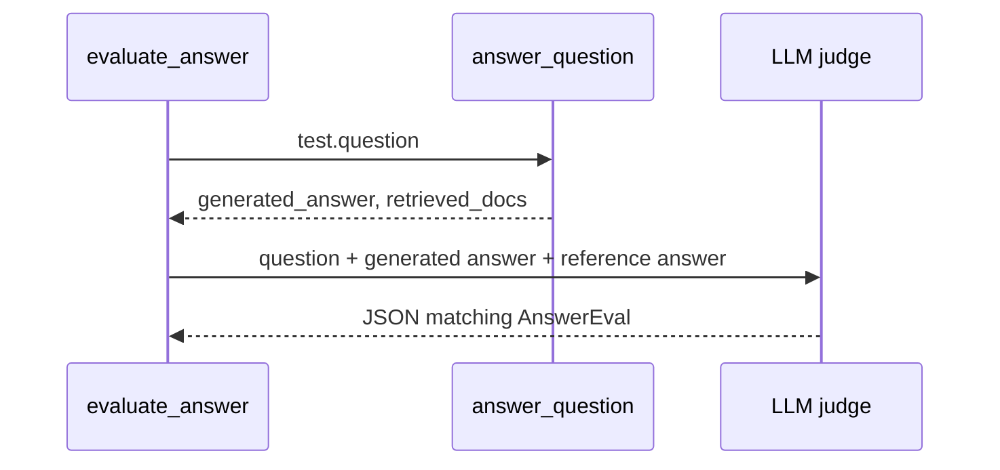

# 08 - LLM-As-A-Judge

## Why Use A Judge?

Retrieval metrics answer: did we retrieve likely evidence?

They do not answer: did the assistant write a good final answer?

The final answer may be:

- factually wrong,
- partially correct but incomplete,
- correct but cluttered with unrelated information,
- phrased differently from the reference answer.

String matching is too brittle for this. LLM-as-a-judge uses a second model call to score answer quality with a rubric.

## The Judge Flow



The judge is not the same as the answering call. It is a separate evaluation call.

## The AnswerEval Schema

[`evaluation/eval.py`](../rag-system/evaluation/eval.py) defines:

```python
class AnswerEval(BaseModel):
    feedback: str
    accuracy: float
    completeness: float
    relevance: float
```

Each field has a clear meaning:

| Field | Question it answers |
|-------|---------------------|
| `feedback` | What did the judge notice? |
| `accuracy` | Is the generated answer factually correct compared with the reference? |
| `completeness` | Did it include all important information from the reference? |
| `relevance` | Did it answer the asked question without drifting? |

Scores are from 1 to 5.

## Why Structured Output Matters

The judge call uses:

```python
completion(
    model=JUDGE_MODEL,
    messages=judge_messages,
    response_format=AnswerEval,
)
```

That asks the model to return data that can be parsed into `AnswerEval`.

Without structured output, the model might answer in free-form prose:

```text
This is mostly correct. I would give it around four out of five.
```

That is hard for dashboards and regression tests to aggregate. Structured output gives the code reliable numeric fields.

## What The Judge Sees

The current judge prompt includes:

1. the original question,
2. the generated answer,
3. the reference answer,
4. instructions to score accuracy, completeness, and relevance.

Simplified shape:

```text
Question:
<test.question>

Generated Answer:
<answer from RAG>

Reference Answer:
<expected answer>

Evaluate accuracy, completeness, and relevance from 1 to 5.
```

Important limitation: the judge does not currently receive the retrieved context. It compares answer to reference, not answer to source documents. If you want source-grounded judging, you would add retrieved chunks to the judge prompt and adjust the rubric.

## Minimal Example Of The Schema

```python
from evaluation.eval import AnswerEval

sample = AnswerEval(
    feedback="Accurate and complete.",
    accuracy=5.0,
    completeness=5.0,
    relevance=5.0,
)

print(sample.model_dump_json(indent=2))
```

Example output:

```json
{
  "feedback": "Accurate and complete.",
  "accuracy": 5.0,
  "completeness": 5.0,
  "relevance": 5.0
}
```

## Running The Judge

Run one test row:

```bash
python evaluation/eval.py 0
```

Example output:

```text
Generated Answer:
 Maxine Thompson won the IIOTY award in 2023.

Feedback:
 The generated answer matches the reference answer.

Scores:
  Accuracy: 5.00/5
  Completeness: 5.00/5
  Relevance: 5.00/5
```

## How To Interpret Scores

| Score pattern | Likely meaning |
|---------------|----------------|
| High accuracy, low completeness | The answer is true but missing details. |
| Low accuracy, high relevance | The answer addressed the question but got facts wrong. |
| High completeness, low relevance | The answer includes facts but adds off-topic material. |
| All low | Retrieval, prompting, or generation likely failed badly. |

Always inspect the generated answer and retrieved context when scores surprise you.

## Strengths And Weaknesses

| Strength | Weakness |
|----------|----------|
| Handles paraphrases better than exact string matching. | Adds cost and latency. |
| Produces readable feedback. | Can be inconsistent across models or prompts. |
| Easy to batch across many tests. | May miss subtle factual or policy issues. |
| Useful for regression testing. | Should not replace human review for high-stakes use. |

## Improving The Judge

Common improvements include:

- Add retrieved context to the judge prompt.
- Ask for citation faithfulness separately.
- Use multiple judges or repeated runs for stability.
- Store judge outputs so regressions can be compared over time.
- Add human review for representative failures.

## What To Remember

- LLM-as-a-judge evaluates generated answers, not retrieval by itself.
- This module's judge compares generated answer against a reference answer.
- Structured output makes judge results usable in dashboards and scripts.
- Judge scores are useful signals, not absolute truth.

Next: [`09-the-gradio-applications.md`](09-the-gradio-applications.md)
