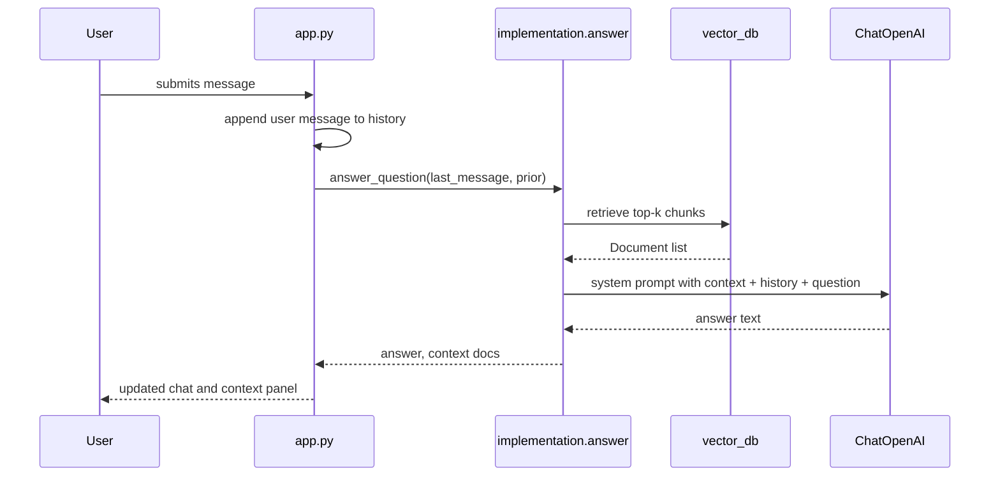
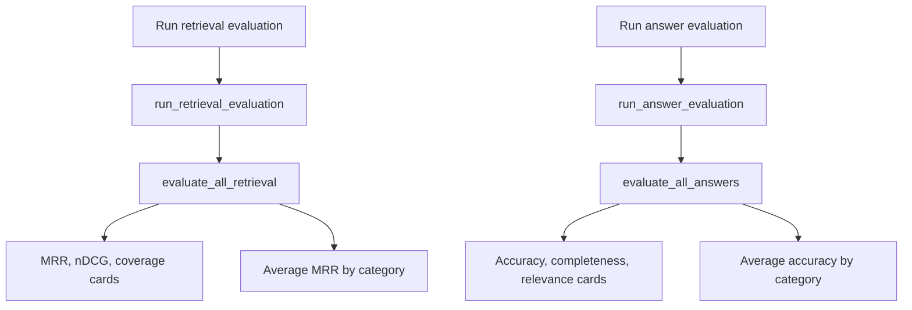

# 09 - The Gradio Applications

## Why The Apps Exist

The module includes two Gradio apps:

1. [`app.py`](../rag-system/app.py) for interactive chat.
2. [`evaluator.py`](../rag-system/evaluator.py) for evaluation dashboards.

These apps are not separate RAG systems. They are user interfaces around the same baseline code explained earlier.

## App 1: Chat UI

[`app.py`](../rag-system/app.py) imports:

```python
from implementation.answer import answer_question
```

That single import is the key connection. The chat app uses the baseline `answer_question()` function from guide 05.

## Chat UI Flow



## `put_message_in_chatbot()`

Inside `main()`, this helper takes textbox input and adds it to the Gradio chat history:

```python
def put_message_in_chatbot(message, history):
    return "", history + [{"role": "user", "content": message}]
```

What enters:

- `message`: the latest text from the user,
- `history`: existing chat messages.

What exits:

- empty string to clear the textbox,
- updated chat history containing the new user message.

## `chat(history)`

```python
def chat(history):
    last_message = history[-1]["content"]
    prior = history[:-1]
    answer, context = answer_question(last_message, prior)
    history.append({"role": "assistant", "content": answer})
    return history, format_context(context)
```

This is where the UI calls the RAG pipeline.

Step by step:

1. Pull the latest user message from the history.
2. Treat all earlier messages as prior conversation.
3. Call `answer_question()`.
4. Append the assistant answer to the chat.
5. Format retrieved chunks for the side panel.

## `format_context(context)`

The chat app does something very useful for learning: it shows the retrieved chunks.

```python
for doc in context:
    result += f"Source: {doc.metadata['source']}"
    result += doc.page_content
```

This panel is a debugging tool. If the assistant gives a bad answer, look at the retrieved context first:

- If the right evidence is missing, retrieval failed.
- If the right evidence is present but the answer is wrong, prompting or generation failed.

## Running The Chat App

First run baseline ingest if needed:

```bash
python -m implementation.ingest
```

Then start the app:

```bash
python app.py
```

Example terminal output:

```text
Running on local URL:  http://127.0.0.1:7860
```

If the browser does not open automatically, open the printed local URL.

## What You Should See

The UI has two main regions:

| Region | Purpose |
|--------|---------|
| Conversation | User and assistant messages. |
| Retrieved context | Source paths and chunk text used for the latest answer. |

Do not ignore the context panel. It is the fastest way to understand how retrieval affects the answer.

## App 2: Evaluation Dashboard

[`evaluator.py`](../rag-system/evaluator.py) imports:

```python
from evaluation.eval import evaluate_all_answers, evaluate_all_retrieval
```

So the dashboard is a visual wrapper around the evaluation code from guides 07 and 08.

## Evaluation Dashboard Flow



## Retrieval Button

`run_retrieval_evaluation()` loops through every test:

```python
for test, result, prog_value in evaluate_all_retrieval():
    total_mrr += result.mrr
    total_ndcg += result.ndcg
    total_coverage += result.keyword_coverage
    category_mrr[test.category].append(result.mrr)
```

It produces:

- average MRR,
- average nDCG,
- average keyword coverage,
- a bar chart of average MRR by category.

## Answer Button

`run_answer_evaluation()` loops through every test and runs the judge:

```python
for test, result, prog_value in evaluate_all_answers():
    total_accuracy += result.accuracy
    total_completeness += result.completeness
    total_relevance += result.relevance
    category_accuracy[test.category].append(result.accuracy)
```

It produces:

- average accuracy,
- average completeness,
- average relevance,
- a bar chart of average accuracy by category.

Because it calls the answer model and judge model for every test, answer evaluation is slower and more expensive than retrieval evaluation.

## Traffic-Light Colors

At the top of `evaluator.py`, constants define thresholds:

```python
MRR_GREEN = 0.9
MRR_AMBER = 0.75
ANSWER_GREEN = 4.5
ANSWER_AMBER = 4.0
```

`get_color()` uses those thresholds to style metric cards as green, orange, or red.

These colors are not magic. They are teaching thresholds. In production, thresholds should come from your quality targets and risk tolerance.

## Running The Dashboard

```bash
python evaluator.py
```

Example terminal output:

```text
Running on local URL:  http://127.0.0.1:7861
```

Gradio may choose a different port if 7861 is busy.

## How To Use The Apps While Learning

1. Ask a question in `app.py`.
2. Read the retrieved context panel before reading the answer.
3. Run retrieval evaluation in `evaluator.py`.
4. Look for weak categories.
5. Change one retrieval setting at a time.
6. Re-ingest if the setting affects stored chunks or embeddings.
7. Re-run evaluation.

This loop teaches cause and effect.

## What To Remember

- `app.py` is a UI around baseline `answer_question()`.
- `evaluator.py` is a UI around baseline evaluation functions.
- The context panel is for debugging retrieval.
- Answer evaluation is slower because it generates answers and calls an LLM judge.

Next: [`10-production-considerations-and-tradeoffs.md`](10-production-considerations-and-tradeoffs.md)
