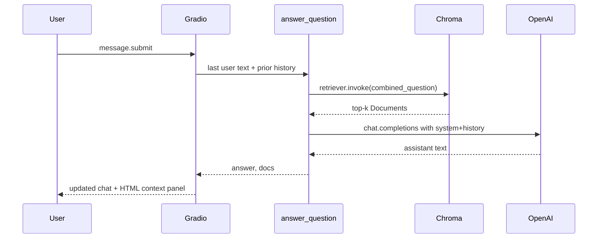

# 09 — The Gradio applications

## What this guide is about

Two UIs ship with this module:

1. **`app.py`** — chat with the baseline assistant while viewing retrieved chunks.
2. **`evaluator.py`** — batch-run retrieval metrics and answer-judge metrics with charts.

## Chat app (`app.py`)

### Flow



### Run it

```bash
cd rag-system
python app.py
```

**Example output (terminal):**

```text
Running on local URL:  http://127.0.0.1:7860
```

What this output tells you: a browser tab should open; if not, visit the printed URL.

### What you should see in the UI (text description)

- **Left column**: chat messages (user + assistant).
- **Right column**: HTML titled **Relevant context** listing each chunk’s `metadata['source']` followed by chunk text — this is the output of `format_context()` in `app.py`.

### Code hook — where retrieval happens

`app.py` imports `answer_question` from `implementation.answer` — the same function used by evaluation, so the UI matches the harness.

## Evaluation dashboard (`evaluator.py`)

### Run it

```bash
cd rag-system
python evaluator.py
```

**Example output (terminal):**

```text
Running on local URL:  http://127.0.0.1:7861
```

What this output tells you: Gradio picked a port (7861 if 7860 is busy).

### What each button does

| Button | Backend function | Output widgets |
|--------|------------------|----------------|
| **Run retrieval evaluation** | `run_retrieval_evaluation` | HTML cards for MRR, nDCG, coverage + bar chart of MRR by category |
| **Run answer evaluation** | `run_answer_evaluation` | HTML cards for accuracy/completeness/relevance + bar chart by category |

### Sample HTML card (textual mock)

When averages are good, the HTML might render like:

```text
Mean Reciprocal Rank (MRR)
0.8124   (left border green)

Normalized DCG (nDCG)
0.9050   (left border green)

Keyword Coverage
88.5%    (left border orange)
```

What this output tells you: **traffic-light borders** encode thresholds defined at the top of `evaluator.py`.

## What to remember

- **Chat UI** = qualitative debugging (read the retrieved chunks!).
- **Dashboard** = quantitative regression view across all 150 tests.

Next: [`10-production-considerations-and-tradeoffs.md`](10-production-considerations-and-tradeoffs.md)
