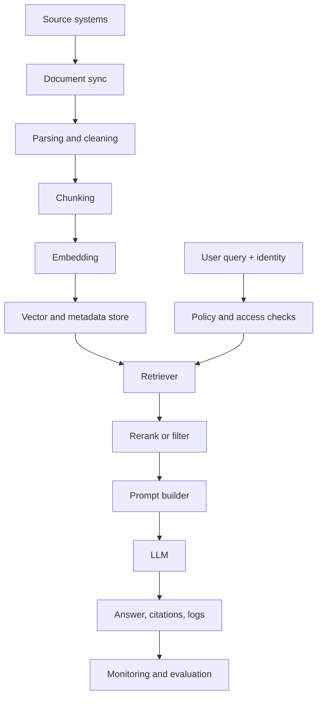

# 10 - Production Considerations And Tradeoffs

## Why Production RAG Is Harder

The module code is a learning system. A production RAG system must also handle:

- user permissions,
- private data,
- changing documents,
- monitoring,
- cost,
- latency,
- evaluation drift,
- failure handling,
- auditability.

The concepts are the same, but the engineering constraints are stricter.

## The Production Version Of The Pipeline



This repo implements the core learning loop. A real deployment adds ingestion pipelines, access checks, observability, and governance around it.

## Data Freshness

RAG is useful because facts can be updated without retraining the model. But the vector database does not update itself automatically.

In this module:

```bash
python -m implementation.ingest
```

rebuilds the baseline `vector_db/`.

In production, you would need a policy:

| Change pattern | Common approach |
|----------------|-----------------|
| Documents update rarely | Scheduled full re-ingest. |
| Documents update often | Incremental ingestion by changed file. |
| Documents can be deleted | Delete matching vectors and metadata. |
| Documents have versions | Store version IDs in metadata. |

## Chunking Tradeoffs

Chunking affects quality, cost, and latency.

| Decision | Benefit | Risk |
|----------|---------|------|
| Smaller chunks | More precise retrieval. | Missing surrounding context. |
| Larger chunks | More context per result. | More noise and prompt cost. |
| More overlap | Fewer boundary failures. | More duplicate vectors. |
| LLM chunking | Better semantic units. | Slower, costlier, less deterministic. |

The right chunking strategy depends on the corpus. Contracts, tables, source code, chat logs, and policies often need different chunking rules.

## Embedding Model Choice

The baseline uses OpenAI `text-embedding-3-large`. The local demo uses `sentence-transformers/all-MiniLM-L6-v2`.

| Option | Strength | Tradeoff |
|--------|----------|----------|
| Large hosted embedding model | Strong retrieval quality, no local GPU required. | API cost, network latency, data leaves local machine. |
| Small local model | Cheap after setup, data can stay local. | Lower quality for some domains, hardware management. |
| Domain-specific model | Better for specialized vocabulary. | More evaluation and maintenance. |

Changing embedding models usually requires re-ingesting the vector database. Stored vectors from different models should not be mixed casually because they live in different vector spaces.

## Vector Store Choice

Chroma is good for this course because it is local and simple.

Production choices depend on requirements:

| Need | Possible direction |
|------|--------------------|
| Simple local prototype | Chroma. |
| SQL consistency and app data nearby | Postgres with pgvector. |
| Managed scaling | Pinecone, Weaviate Cloud, cloud search services. |
| Keyword plus vector search | Elasticsearch/OpenSearch hybrid retrieval. |
| Strict tenant isolation | Separate indexes, namespaces, or access-filtered metadata. |

The vector database must store metadata reliably. Retrieval without metadata is hard to debug and hard to secure.

## Access Control

This teaching repo does not enforce user permissions. A real assistant must not retrieve chunks the user is not allowed to see.

Example:

- HR salary documents should not be visible to every employee.
- Customer contracts may be restricted to sales, legal, or account teams.
- Internal strategy documents may require special roles.

Common pattern:

1. Store access metadata with each chunk.
2. Identify the user making the request.
3. Filter retrieval by permissions before chunks enter the prompt.
4. Log which sources were used.

Never rely on the LLM to ignore unauthorized context. Do not put unauthorized context into the prompt in the first place.

## Prompt And Citation Reliability

The baseline prompt says:

```text
If relevant, use the given context to answer any question.
If you don't know the answer, say so.
```

Production prompts often need stricter behavior:

- answer only from provided context,
- cite source documents,
- distinguish evidence from inference,
- refuse when evidence is missing,
- avoid exposing hidden system or policy text.

If citations matter, make source paths or document IDs part of the context and require the model to cite them.

## Latency And Cost

Every step can add time and money:

| Step | Cost driver |
|------|-------------|
| Query rewrite | Extra LLM call. |
| Retrieval | Vector database query time. |
| Reranking | Extra LLM call over many chunks. |
| Long prompts | More input tokens. |
| Answer generation | Output tokens and model latency. |
| Judge evaluation | Additional model call per test answer. |

The advanced stack can improve quality, but it is more expensive than the baseline. That is a real production tradeoff.

## Rate Limits And Retries

The advanced code uses Tenacity retries:

```python
WAIT = wait_exponential(multiplier=1, min=10, max=240)
```

This means fragile LLM calls can wait and retry instead of failing immediately.

Retries help with temporary provider errors. They do not solve:

- invalid credentials,
- bad prompts,
- permanent schema mismatches,
- exhausted budgets,
- excessive concurrency.

For advanced ingest, reduce concurrency if you hit rate limits:

```bash
export INSURELLM_INGEST_WORKERS=1
python -m pro_implementation.ingest
```

## Evaluation In Production

The module's `tests.jsonl` is an offline evaluation set. Production needs more layers:

| Layer | Purpose |
|-------|---------|
| Offline test suite | Catch regressions before deployment. |
| Golden questions | Protect critical business facts. |
| Human review | Validate complex or high-risk answers. |
| Online feedback | Capture thumbs, escalations, edits, user reports. |
| Drift monitoring | Detect when real questions differ from the test set. |
| Source auditing | Track which documents support answers. |

Evaluation sets should evolve as users ask new questions and documents change.

## RAG Vs Fine-Tuning

Use RAG when:

- facts change frequently,
- answers need source traceability,
- private documents are the source of truth,
- you need to update knowledge without retraining.

Use fine-tuning when:

- you need a consistent style or format,
- the behavior is stable,
- the model must learn repeated task patterns,
- facts are not the main problem.

Many mature systems use both: RAG for fresh facts, fine-tuning or instructions for behavior and formatting.

## Common Failure Modes

| Symptom | Likely cause | First mitigation |
|---------|--------------|------------------|
| Correct source not retrieved | Chunking or query mismatch. | Try query rewriting, hybrid search, or chunk tuning. |
| Source retrieved but answer wrong | Prompt or generation issue. | Strengthen instruction to use only context and cite evidence. |
| Answers are too slow | Too many model calls or too much context. | Reduce `k`, skip rerank, cache, or use a faster model. |
| Numbers are wrong | Numeric data split or summarized poorly. | Use table-aware parsing or tool-based lookup. |
| Good eval, bad users reports | Test set does not match real usage. | Add real anonymized failures to evaluation. |
| Security concern | Unauthorized chunks retrieved. | Add permission filters before prompt construction. |

## What To Remember

- Production RAG is retrieval plus operations, security, evaluation, and monitoring.
- Any change to chunking or embedding usually requires re-ingestion.
- The advanced techniques improve quality only if their cost and failure modes are managed.
- Do not put data into the prompt that the user is not allowed to see.
- Treat this module as a learning sandbox, then harden each boundary before real use.

You finished the documentation path. Return to [`README.md`](../README.md) for setup and command reminders.
