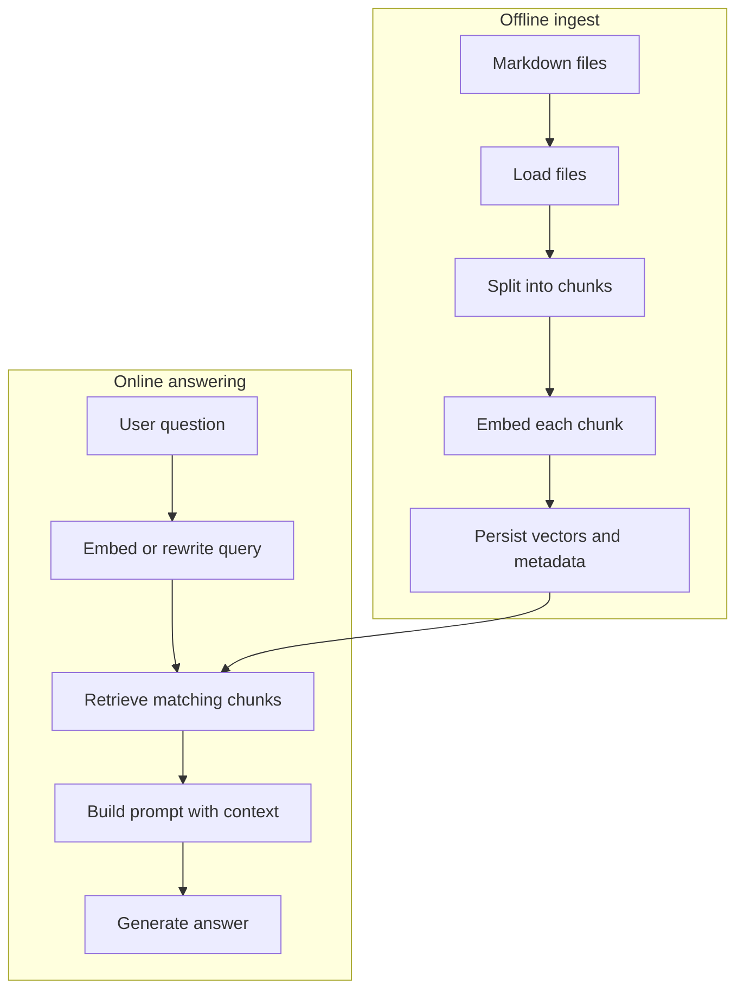

# Documentation Index - Module 04 (RAG)

This documentation is designed to read like a short course. It starts with the reason RAG exists, then builds the pieces one at a time, and only then moves into advanced retrieval and production tradeoffs.

If you are new to RAG, do not begin with `implementation/answer.py`. Begin with the mental model below, then follow the guides in order.

## The Mental Model

A RAG system has two different lifecycles:

The ingest lifecycle prepares the library. The answering lifecycle uses that prepared library for each user question.

## Best Reading Order

0. [`00-system-map-and-file-tour.md`](00-system-map-and-file-tour.md) - the whole module, file by file.
1. [`01-what-is-rag-and-why-it-exists.md`](01-what-is-rag-and-why-it-exists.md) - why retrieval is needed at all.
2. [`02-embeddings-and-vector-databases.md`](02-embeddings-and-vector-databases.md) - how meaning becomes searchable numbers.
3. [`03-chunking-strategies.md`](03-chunking-strategies.md) - why documents are split before embedding.
4. [`04-retrieval-pipelines-and-similarity-search.md`](04-retrieval-pipelines-and-similarity-search.md) - how a question becomes top-k evidence.
5. [`05-building-the-basic-rag-pipeline.md`](05-building-the-basic-rag-pipeline.md) - the baseline implementation end to end.
6. [`06-advanced-rag-query-rewriting-and-reranking.md`](06-advanced-rag-query-rewriting-and-reranking.md) - how the pro stack improves recall and precision.
7. [`07-evaluating-rag-systems.md`](07-evaluating-rag-systems.md) - how retrieval quality is measured.
8. [`08-llm-as-a-judge.md`](08-llm-as-a-judge.md) - how answer quality is scored.
9. [`09-the-gradio-applications.md`](09-the-gradio-applications.md) - how the UI calls the pipeline.
10. [`10-production-considerations-and-tradeoffs.md`](10-production-considerations-and-tradeoffs.md) - what changes beyond a learning repo.

## How The Code Is Organized

| Folder or file under `rag-system/` | Purpose | Reads from | Writes or returns |
|------------------------------------|---------|------------|-------------------|
| `knowledge-base/` | Source documents for the fictional company. | Nothing. | Markdown facts used by retrieval. |
| `implementation/ingest.py` | Baseline offline ingest. | `knowledge-base/` | `vector_db/` Chroma store. |
| `implementation/answer.py` | Baseline online answering. | `vector_db/` | `(answer_text, retrieved_docs)`. |
| `pro_implementation/ingest.py` | Advanced offline ingest with LLM-authored chunks. | `knowledge-base/` | `preprocessed_db/` Chroma store. |
| `pro_implementation/answer.py` | Advanced online answering with rewrite and rerank. | `preprocessed_db/` | `(answer_text, reranked_chunks)`. |
| `evaluation/test.py` | Loads the JSONL test suite. | `evaluation/tests.jsonl` | `TestQuestion` objects. |
| `evaluation/eval.py` | Scores baseline retrieval and answers. | `implementation/answer.py`, `tests.jsonl` | Metrics and judge results. |
| `app.py` | Chat UI. | `implementation.answer.answer_question` | Chat response and context panel. |
| `evaluator.py` | Evaluation UI. | `evaluation/eval.py` | Metric cards and charts. |
| `examples/` | Small scripts for each learning step. | Varies by example. | Terminal output and optional plot. |

## Glossary

| Term | Beginner meaning |
|------|------------------|
| RAG | Retrieve useful text first, then generate an answer with that text in the prompt. |
| Knowledge base | The source documents the assistant is allowed to use. |
| Chunk | A smaller slice of a document. Retrieval returns chunks, not usually whole files. |
| Embedding | A list of numbers that represents the meaning of text. |
| Vector database | A database built to store embeddings and find nearby embeddings quickly. |
| Semantic similarity | Similarity by meaning, not exact word matching. |
| Retriever | Code that takes a query and returns the most relevant chunks. |
| Top-k | The number of chunks retrieved. If `k = 10`, the retriever returns 10 chunks. |
| Prompt augmentation | Adding retrieved context to the prompt before asking the LLM to answer. |
| Reranking | Reordering initially retrieved chunks with a more careful relevance check. |
| Evaluation set | A list of test questions with expected evidence or answers. |
| LLM-as-a-judge | A model call that scores another model's answer against a rubric. |

## What To Focus On First

If you only have one hour:

1. Read guide 00 to understand the file map.
2. Run `python -m implementation.ingest`.
3. Read guide 05 while looking at `implementation/ingest.py` and `implementation/answer.py`.
4. Run `python examples/03_basic_rag_demo.py`.
5. Read guide 07 to understand what the evaluation numbers mean.

## What This Module Is Not

This is not a production security blueprint. The knowledge base is synthetic, access control is not implemented, and the evaluation suite is a teaching harness. Guide 10 explains what would need hardening for real company data.

Next: [`00-system-map-and-file-tour.md`](00-system-map-and-file-tour.md)
