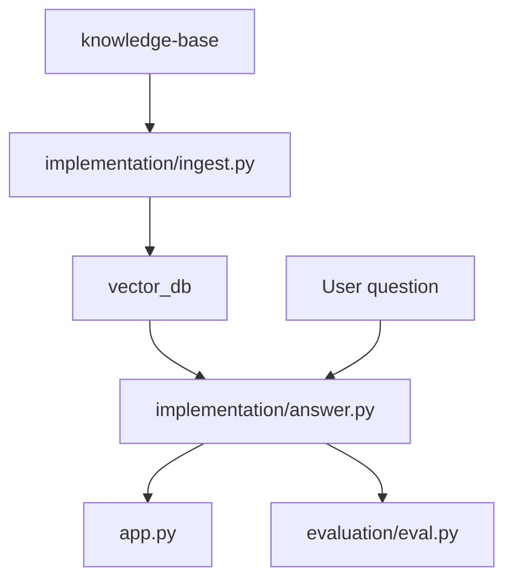

# RAG System Code Map

This folder contains the runnable Insurellm RAG system. The course documentation explains the concepts; this file helps you navigate the code.

## Start Here

If you want the standard baseline flow:

```bash
python -m implementation.ingest
python app.py
```

If you want to inspect one answer without the UI:

```bash
python examples/03_basic_rag_demo.py
```

If you want evaluation:

```bash
python examples/04_evaluation_demo.py
python evaluation/eval.py 0
python evaluator.py
```

## Main Data Flow



The source Markdown files are loaded once during ingest. At question time, the assistant reads from the vector database, not directly from the Markdown files.

## Folder Responsibilities

| Path | Responsibility |
|------|----------------|
| `knowledge-base/` | Source corpus of company, product, contract, and employee Markdown files. Do not add tutorial notes here, because ingest treats Markdown files in this folder as retrievable facts. |
| `implementation/` | Baseline RAG implementation used by the app and evaluator. |
| `pro_implementation/` | Advanced RAG implementation used by the advanced demo. |
| `evaluation/` | Test suite loader, retrieval metrics, and LLM judge logic. |
| `examples/` | Small scripts that isolate individual learning concepts. |
| `app.py` | Gradio chat UI for the baseline assistant. |
| `evaluator.py` | Gradio dashboard for baseline evaluation. |

## Baseline Files

| File | What it does |
|------|--------------|
| `implementation/ingest.py` | Loads Markdown, creates fixed-size overlapping chunks, embeds them, and writes `vector_db/`. |
| `implementation/answer.py` | Opens `vector_db/`, retrieves top-k chunks for a question, inserts them into a system prompt, and calls the chat model. |

The central function is:

```python
answer, docs = answer_question(question, history=[])
```

It returns both the answer and the retrieved documents so the UI and evaluator can inspect the evidence.

## Advanced Files

| File | What it does |
|------|--------------|
| `pro_implementation/ingest.py` | Uses an LLM to create richer chunks with headline, summary, and original text, then writes `preprocessed_db/`. |
| `pro_implementation/answer.py` | Rewrites the query, performs dual retrieval, merges chunks, reranks them with an LLM, and generates an answer. |

The advanced path is separate. The default app and evaluator do not call it.

## Evaluation Files

| File | What it does |
|------|--------------|
| `evaluation/tests.jsonl` | 150 test questions with keywords, reference answers, and categories. |
| `evaluation/test.py` | Loads JSONL rows into `TestQuestion` objects. |
| `evaluation/eval.py` | Computes retrieval metrics and answer judge scores for the baseline system. |

## Generated Directories

These directories are created by running ingest and are not source knowledge:

| Directory | Created by | Used by |
|-----------|------------|---------|
| `vector_db/` | `python -m implementation.ingest` | `implementation/answer.py` |
| `preprocessed_db/` | `python -m pro_implementation.ingest` | `pro_implementation/answer.py` |

If you change chunking settings or embedding models, rebuild the relevant database.

## Environment Variables

| Variable | Used by | Purpose |
|----------|---------|---------|
| `OPENAI_API_KEY` | Baseline and advanced code | Auth for OpenAI embeddings and chat calls. |
| `INSURELLM_VECTOR_DB` | Baseline ingest/answer | Override `vector_db/` location. |
| `INSURELLM_PREPROCESSED_DB` | Advanced ingest/answer | Override `preprocessed_db/` location. |
| `INSURELLM_CHUNK_MODEL` | Advanced ingest | Choose LiteLLM model for LLM chunking. |
| `INSURELLM_PRO_CHAT_MODEL` | Advanced answer | Choose LiteLLM model for rewrite, rerank, and answer. |
| `INSURELLM_INGEST_WORKERS` | Advanced ingest | Control parallel LLM chunking. |
| `INSURELLM_DEMO_MODEL` | Keyword example | Choose model for the first simple demo. |

## Learning Path Through Code

1. Read `examples/01_keyword_retrieval_demo.py` to see retrieval without vectors.
2. Read `implementation/ingest.py` to see documents become chunks and vectors.
3. Read `implementation/answer.py` to see chunks become prompt context.
4. Read `app.py` to see how the UI calls `answer_question()`.
5. Read `evaluation/eval.py` to see how retrieval and answer quality are measured.
6. Read `pro_implementation/answer.py` after the baseline feels clear.

For the full course explanation, start with [`../documentation/README.md`](../documentation/README.md).
