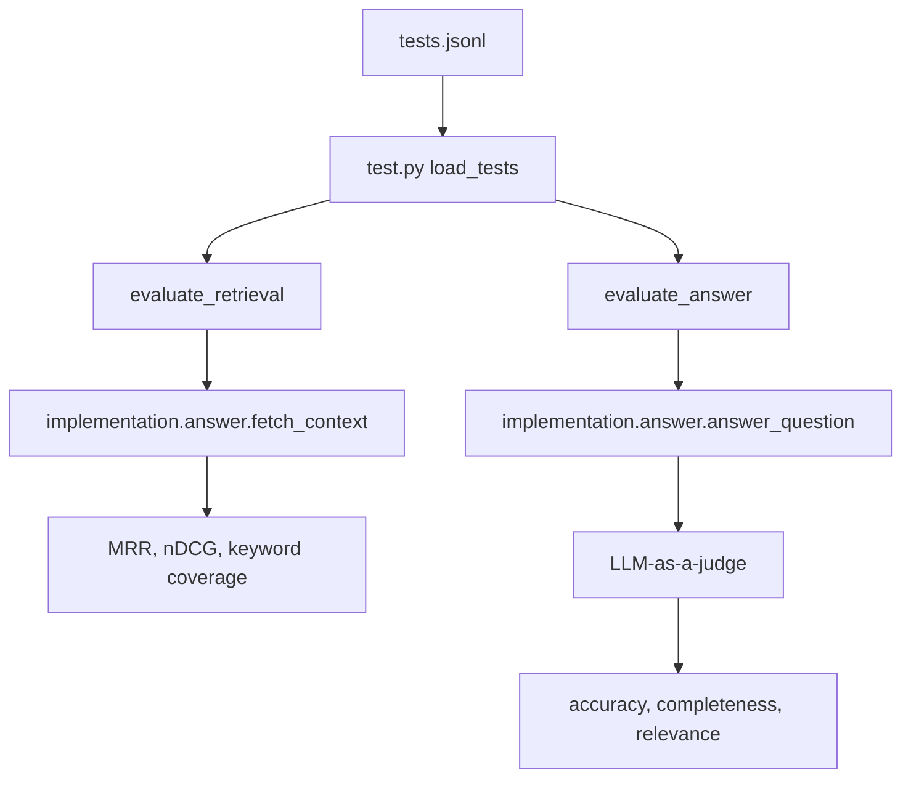

# Evaluation

This folder evaluates the baseline RAG system. It measures retrieval quality and answer quality separately.

## Files

| File | Purpose |
|------|---------|
| `tests.jsonl` | Test questions with expected keywords, reference answers, and categories. |
| `test.py` | Loads JSONL rows into `TestQuestion` objects. |
| `eval.py` | Computes retrieval metrics and answer judge scores. |

## Evaluation Flow



## Test Row Shape

Each line in `tests.jsonl` looks like:

```json
{
  "question": "Who won the prestigious IIOTY award in 2023?",
  "keywords": ["Maxine", "Thompson", "IIOTY"],
  "reference_answer": "Maxine Thompson won the prestigious Insurellm Innovator of the Year (IIOTY) award in 2023.",
  "category": "direct_fact"
}
```

Fields:

| Field | Used for |
|-------|----------|
| `question` | Sent to the RAG system. |
| `keywords` | Retrieval metrics scan retrieved chunks for these anchors. |
| `reference_answer` | LLM judge compares generated answer against this. |
| `category` | Dashboard grouping and failure analysis. |

## Retrieval Metrics

| Metric | Meaning |
|--------|---------|
| MRR | How early the first keyword-bearing chunk appears. |
| nDCG | How good the ranking is compared with an ideal ranking. |
| Keyword coverage | Percentage of expected keywords found anywhere in retrieved chunks. |

## Answer Metrics

The answer judge returns:

| Metric | Meaning |
|--------|---------|
| Accuracy | Factual correctness against the reference answer. |
| Completeness | Whether important reference details are included. |
| Relevance | Whether the answer directly addresses the question. |

## Running Evaluation

From `rag-system/`:

```bash
python examples/04_evaluation_demo.py
python evaluation/eval.py 0
python evaluator.py
```

`eval.py` imports the baseline implementation:

```python
from implementation.answer import answer_question, fetch_context
```

Changes to `pro_implementation/` do not affect these metrics unless you rewire the evaluator.

For the full teaching walkthrough, read [`../../documentation/07-evaluating-rag-systems.md`](../../documentation/07-evaluating-rag-systems.md) and [`../../documentation/08-llm-as-a-judge.md`](../../documentation/08-llm-as-a-judge.md).
