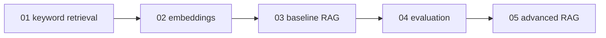

# Examples - Progressive Demos

These scripts are small on purpose. Each one isolates one idea from the full RAG system so you can learn the pipeline in stages.

Run examples from the `rag-system/` directory:

```bash
python examples/03_basic_rag_demo.py
```

## Example Map

| Order | Script | Needs | What it teaches |
|-------|--------|-------|-----------------|
| 1 | `01_keyword_retrieval_demo.py` | `OPENAI_API_KEY` | The RAG pattern before embeddings: choose context, put it in the prompt, generate an answer. |
| 2 | `02_embeddings_and_visualization.py` | local model download on first run | Chunking and embeddings with a smaller local model; optional t-SNE plot. |
| 3 | `03_basic_rag_demo.py` | ingested `vector_db/` | One question through the real baseline `answer_question()` function. |
| 4 | `04_evaluation_demo.py` | ingested `vector_db/` | Retrieval metrics for one evaluation row. |
| 5 | `05_advanced_rag_demo.py` | ingested `preprocessed_db/` | Query rewrite, dual retrieval, reranking, and advanced answer generation. |

## How The Examples Build On Each Other



## Before Running Example 3 Or 4

Build the baseline vector database:

```bash
python -m implementation.ingest
```

Then run:

```bash
python examples/03_basic_rag_demo.py
python examples/04_evaluation_demo.py
```

Example output from `03_basic_rag_demo.py`:

```text
Question: How many employees does Insurellm currently have?

Top sources:
  1. .../knowledge-base/company/overview.md
     # Insurellm Overview ...

Answer:
 Insurellm currently has 32 employees.
```

## Before Running Example 5

Build the advanced vector database:

```bash
python -m pro_implementation.ingest
```

Then run:

```bash
python examples/05_advanced_rag_demo.py
```

This path costs more because advanced ingest calls an LLM to create chunks, and advanced answering uses rewrite and rerank calls.

## What To Inspect

When you run an example, do not only read the final answer. Also inspect:

- which source file was retrieved,
- whether the retrieved text contains the needed fact,
- whether the answer uses that fact accurately,
- whether changing the question changes retrieval.

That habit is the heart of debugging RAG systems.
