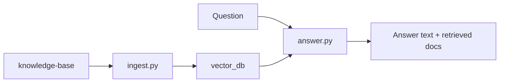

# Baseline Implementation

This folder contains the baseline RAG system. It is the main implementation used by the chat app and the evaluation harness.

## Files

| File | Purpose |
|------|---------|
| `ingest.py` | Offline pipeline: load Markdown, split into chunks, embed chunks, write `vector_db/`. |
| `answer.py` | Online pipeline: retrieve chunks from `vector_db/`, build a prompt, generate an answer. |

## Baseline Flow



## `ingest.py`

Run from `rag-system/`:

```bash
python -m implementation.ingest
```

The script calls:

1. `fetch_documents()` - loads all Markdown files from `knowledge-base/`.
2. `create_chunks()` - splits documents into overlapping chunks.
3. `create_embeddings()` - embeds chunks and persists them in Chroma.

Important settings:

| Name | Default | Meaning |
|------|---------|---------|
| `CHUNK_SIZE` | `500` | Target chunk length in characters. |
| `CHUNK_OVERLAP` | `200` | Repeated characters between neighboring chunks. |
| `EMBEDDING_MODEL` | `text-embedding-3-large` | OpenAI embedding model. |
| `INSURELLM_VECTOR_DB` | unset | Optional override for `vector_db/` location. |

## `answer.py`

Main function:

```python
answer, docs = answer_question(question, history=[])
```

It calls:

1. `combined_question()` - combines prior user turns and the latest question for retrieval.
2. `fetch_context()` - retrieves top `RETRIEVAL_K` chunks from Chroma.
3. `SYSTEM_PROMPT.format(context=...)` - inserts retrieved text into the prompt.
4. `llm.invoke(messages)` - asks the chat model for the final answer.

It returns both:

- `answer`: the assistant's text,
- `docs`: retrieved chunks for debugging, UI display, and evaluation.

## Used By

| Caller | How it uses this folder |
|--------|-------------------------|
| `app.py` | Calls `answer_question()` for each chat turn. |
| `evaluation/eval.py` | Calls `fetch_context()` and `answer_question()` for metrics. |
| `examples/03_basic_rag_demo.py` | Prints one baseline answer and top sources. |
| `examples/04_evaluation_demo.py` | Runs retrieval metrics through evaluation code. |

For the full teaching walkthrough, read [`../../documentation/05-building-the-basic-rag-pipeline.md`](../../documentation/05-building-the-basic-rag-pipeline.md).
