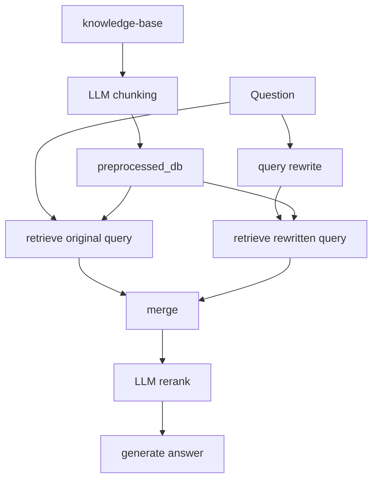

# Advanced Implementation

This folder contains the advanced RAG path. It is separate from the baseline path and is mainly used by `examples/05_advanced_rag_demo.py`.

## Files

| File | Purpose |
|------|---------|
| `ingest.py` | Uses an LLM to create structured chunks, embeds them, and writes `preprocessed_db/`. |
| `answer.py` | Rewrites the query, performs dual retrieval, merges results, reranks chunks, and generates an answer. |

## Advanced Flow



## `ingest.py`

Run from `rag-system/`:

```bash
python -m pro_implementation.ingest
```

The script calls:

1. `fetch_documents()` - reads the Markdown corpus into dictionaries.
2. `process_document()` - asks an LLM to split one document into structured chunks.
3. `create_chunks()` - parallelizes `process_document()` across documents.
4. `create_embeddings()` - embeds final chunk text and writes Chroma collection `docs`.

Each LLM chunk includes:

| Field | Why it exists |
|-------|---------------|
| `headline` | Adds a short search-friendly label. |
| `summary` | Adds a paraphrase of the chunk meaning. |
| `original_text` | Preserves exact source text. |

## `answer.py`

Main function:

```python
answer, chunks = answer_question(question, history=[])
```

The retrieval pipeline is:

1. `rewrite_query()` - create a short search query.
2. `fetch_context_unranked(original_question)` - retrieve candidates for the original wording.
3. `fetch_context_unranked(rewritten_question)` - retrieve candidates for the rewritten wording.
4. `merge_chunks()` - deduplicate candidates.
5. `rerank()` - ask an LLM to order candidates by relevance.
6. `make_rag_messages()` - build a prompt with the final chunks.

## Environment Variables

| Variable | Purpose |
|----------|---------|
| `INSURELLM_PREPROCESSED_DB` | Override `preprocessed_db/` location. |
| `INSURELLM_CHUNK_MODEL` | Choose LiteLLM model for LLM chunking. |
| `INSURELLM_PRO_CHAT_MODEL` | Choose LiteLLM model for rewrite, rerank, and answer. |
| `INSURELLM_INGEST_WORKERS` | Control parallel chunking worker count. |

## Important Boundary

The default chat app and evaluation harness do not use this folder. To evaluate the advanced path, you would need to change imports in `evaluation/eval.py` or create a parallel evaluator.

For the full teaching walkthrough, read [`../../documentation/06-advanced-rag-query-rewriting-and-reranking.md`](../../documentation/06-advanced-rag-query-rewriting-and-reranking.md).
